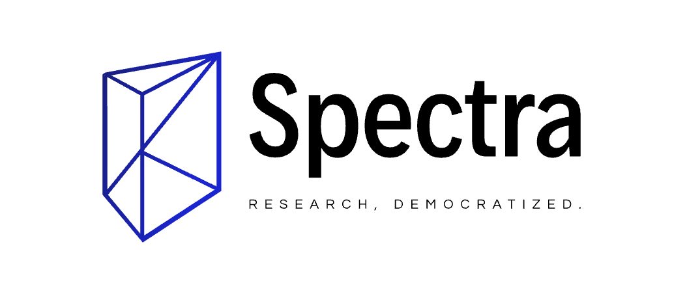

# Overview

Make some money summarizing a research area of ML of your choice.  To compete, submit a PR to this repo which will add a `.md` or `.mmd` to the "submissions" folder.  See [here](./submissions/example.md) to see what a sample submission looks like.

Prizes:
- 1st place: $5,000
- 2nd place: $2,000
- 3rd place: $1,000

Deadline for submission: March 3rd, 2021.

# Details

## Why

If you work on cutting edge Machine Learning and AI like we do at Mathpix, then you know how difficult it can be to navigate the flood of new research papers published every month. It is also difficult to assess the real world practicality of papers published on Arxiv. As many ML practitioners know, just because an approach shows some a small improvement on a benchmark dataset, does not actually mean that approach is superior in practice.  

Unfortunately, the people with nuanced understanding of state-of-the-art ML research don’t typically have much incentive to break down the pros/cons of cutting edge approaches. Such people usually have their hands full with research and development. The result is that most ML summary work is done by altruistic bloggers. Shouldn’t this work be compensated given how valuable it can be? 

For this reason we are excited to announce the first ever Spectra Research Summary Competition as a way of launching of our upcoming publishing platform, Spectra, where ML researchers and practitioners can make money from writing great ML review content for practitioners, and where practitioners can read content in nice HTML first formats.  

## Competition Rules

The rules of the competition are as follows:

- Deadline for submission: March 3rd, 2021.
- The research discussed in the review paper need not be new/original research
- The review paper, however must be original writing and in English
- The goal of the paper should be to summarize/explain cutting edge approaches in a particular subfield of ML (for example machine translation, text summarization, and image segmentation)
- The target audience is ML practitioners or graduate level researchers who find it tough to keep up with rapidly evolving methods and strategies
- Papers must be submitted via PR to this public Github repo

Papers must be submitted as .md (Markdown) or .mmd (Mathpix Markdown) format (TODO: add link to blog article explaining MMD).  Links to external code and repos are acceptable and even encouraged, but the writing should stand on its own.  

## Prize 

The prizes will be determined by the following criteria:

- depth 
- accuracy
- clarity of writing
- good coverage of the most important literature on a given topic

Prizes:
- 1st place: $5,000
- 2nd place: $2,000
- 3rd place: $1,000

Once we have received the submissions, all papers will be posted publicly on our upcoming Spectra platform for the general public to vote for a winner, who will be announced on March 15th.

## Copyright 

Mathpix Inc. reserves to right to publish all submissions, with proper attribution to the authors of course.  
