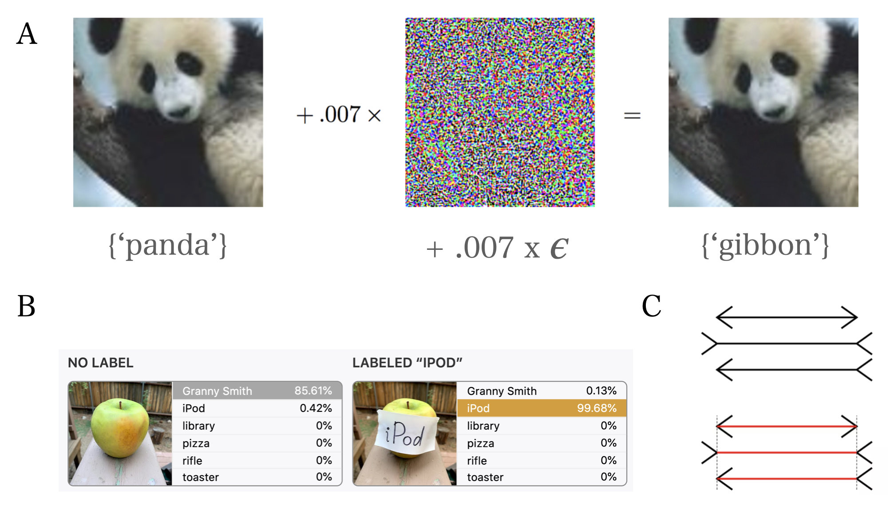
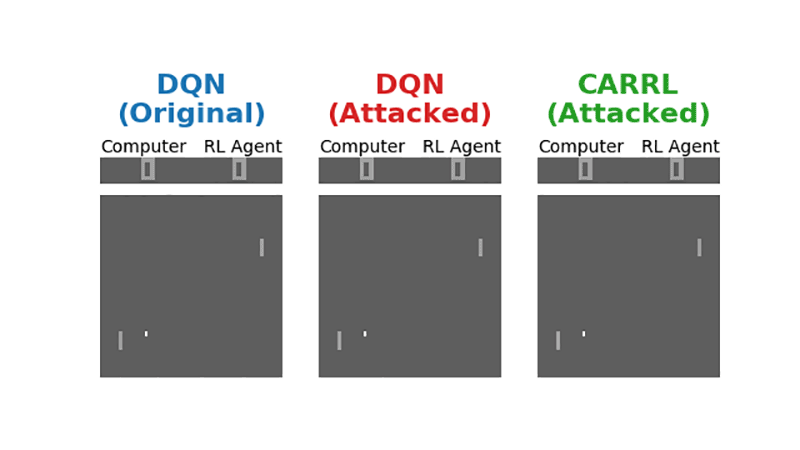
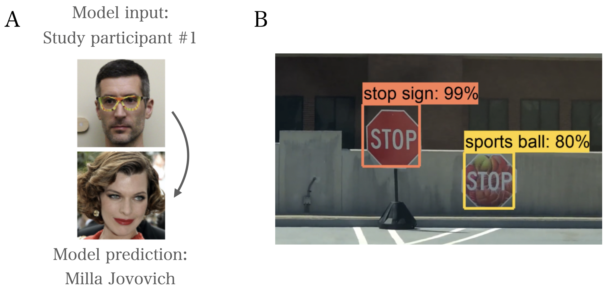

A tutorial accompanying this review can be found [here](https://github.com/veronikasamborska1994/adversarial_attacks).

## Introduction: what is an adversarial attack?

Deep convolutional neural networks (DCNNs) have now reached, and in some cases surpassed, human-level performance at visual object recognition tasks ([He et al., 2015](https://arxiv.org/abs/1512.03385)), including recognition of faces ([Taigman et al., 2014](https://www.cs.toronto.edu/~ranzato/publications/taigman_cvpr14.pdf)), traffic signs ([Ciresan et al., 2012](https://www.sciencedirect.com/science/article/abs/pii/S0893608012000524)), and handwritten digits ([LeCun et al., 1998](https://ieeexplore.ieee.org/document/726791)). This superhuman performance is largely attributed to machine learning advances such as increased complexity of the architecture of networks ([LeCun et al., 2015](https://www.nature.com/articles/nature14539)), advances in nonlinear activation functions ([Russakovsky et al., 2014](https://arxiv.org/abs/1409.0575)), effective regularization techniques ([Srivastava et al., 2014](https://www.cs.toronto.edu/~hinton/absps/JMLRdropout.pdf)), and data training regimes ([Krizhevsky et al., 2012](https://papers.nips.cc/paper/2012/file/c399862d3b9d6b76c8436e924a68c45b-Paper.pdf)). Despite this, these models remain easily tricked by **adversarial attacks**: input images with alterations that can be undetectable to humans but result in confident mis-classifications by the model. There are many obvious commercial implications of this – for example, a self-driving car might cause an accident due to a modified traffic sign, or a biometric access system might be compromised. Understanding why DCNNs (and other neural network architectures) are so vulnerable to adversarial attacks might also provide us with a deeper theoretical insight into how deep neural networks work, and how we might be able to improve them. This review will focus on the setting of convolutional  neural networks, although it is notable that adversarial examples have now been described across many domains of machine learning.

Adversarial attacks can be thought of as optical illusions, but for neural networks (example adversarial attacks are shown in *Figure 1A* and *B*; the Muller-Lyer illusion, a classic optical illusion for humans, is shown in *Figure 1C*). Some of these illusions are created using full knowledge of model architecture and parameters, so called *white-box attacks* ([Sablayrolles et al., 2019](http://proceedings.mlr.press/v97/sablayrolles19a.html)), and the adversary can use various gradient-based methods to curate adversarial examples. These attacks are analogous to creating optical illusions on the basis of full knowledge of the architecture of the human visual system and cognitive foundations of our perception. More often though, the adversarial attacker does not have full access to such specifics of the model – *black-box attacks*. In this case, the attacker can query the model but lacks complete access to its architecture, parameters, and training dataset. One type of such approach in machine learning is to mimic the model and attack this substitute, and then transfer the adversarial images to the original model ([Papernot et al., 2017](https://arxiv.org/abs/1602.02697)). Adversarial examples gathered from such models will often transfer to other models, even without any knowledge of the training dataset or purpose of the new model. Such frailties of generalisation highlight a fundamental vulnerability of existing deep neural networks ([Papernot et al., 2015](https://arxiv.org/abs/1511.07528)).

*Figure 1A: An example of adding an adversarial perturbation to an input image using gradient-based methods ([Goodfellow et al., 2015](https://arxiv.org/abs/1412.6572)). This results in a confident – and highly un-human – mis-classification by the neural network. B: Another example of a high-confidence, un-human error made by a neural network on an object recognition task ([Goh et al., 2021](https://distill.pub/2021/multimodal-neurons/)). C: The classic Muller-Lyer optical illusion for humans, in which all three horizontal lines are of equal length, but usually perceived to be different due to the direction of the arrowheads. One helpful analogy for adversarial attacks is to consider them as optical illusions for models.*

Different adversarial attacks have different goals. In some cases, the goal is to trick a neural network to make *any* mistake (*untargeted attacks*), while in others the aim is to misguide the model to misclassify a *particular* input to a particular target (*targeted attacks*). Methods for adversarial attacks include introducing imperceptible changes (*Figure 1A*; e.g., Papernot et al., 2015, Papernot et al., 2017) that are often applied to the whole image or patch-based methods in which a large but localised change is applied to the image (*Figure 1B* and *Figure 2*) which have been recently shown to be successful for both targeted and untargeted *black-box attacks* ([Cheng et al., 2018](https://arxiv.org/abs/1807.04457)). More recently, spatial distortions have been combined with a perturbation to generate even more realistic adversarial images with even smaller perturbations that do not affect human judgments ([Zhao et al., 2020](https://arxiv.org/abs/2002.01008)).

*Figure 2: Video showing the influence of an adversarial patch on classification accuracy ([Goh et al., 2021](https://distill.pub/2021/multimodal-neurons/)). This example shows the influence of multimodal neurons in the network, which respond not just to the pixel input corresponding to a given object, but also the written name of that object, for example. Such multimodal units provide yet another interesting target for adversarial attacks.*

## Possible explanations for the success of adversarial attacks:

Whatever specific goals and methods are employed, adversarial attacks remain, on the whole, a significant fragility of deep learning models. Still, at this time, there are no general, well-established explanations for why these attacks are so effective. Understanding their cause might prove useful for researchers’ ability to both improve the vulnerability of these models and potentially understand how to prevent them.
 
Several ideas have been proposed to explain the successes of adversarial attacks. Early attempts focused on model overfitting and under-regularization, resulting in the failure of these models to generalise outwith their training dataset ([Goodfellow et al., 2014](https://arxiv.org/abs/1412.6572)). However, generic regularization techniques (e.g. [dropout](https://jmlr.org/papers/v15/srivastava14a.html) and [pre-training](https://www.jmlr.org/papers/volume11/erhan10a/erhan10a.pdf)) have been shown not to be effective against adversarial examples ([Goodfellow et al., 2014](https://arxiv.org/abs/1412.6572)).  Other explanations focused on non-linearities of modern deep neural networks ([Papernot et al., 2015](https://arxiv.org/abs/1511.07528)). However, linear models with input dimensions that are high enough can also be susceptible to adversarial examples, raising doubts about this as a general explanation.
 
While these have been important considerations for training deep neural networks, they are no longer considered the main factors contributing to the failure of existing models on adversarial examples. More recent proposals have identified inappropriate linear behaviour in high-dimensional space to be a potential cause for the success of adversarial images ([Goodfellow et al., 2014](https://arxiv.org/abs/1412.6572)). In high-dimensional linear spaces, individual input features are normalised. For one dimension of each input small perturbations do not change the overall prediction of the classifier, but small changes to *all* dimensions of the inputs will lead to misclassifications. The emergence of high-dimensional linear space may therefore be the root of networks’ susceptibility to adversarial examples.  

## Defences against adversarial attacks:

Our lack of understanding of the reasons why adversarial attacks prove so effective has made the development of defences against them challenging, despite a large body of research dedicated to it ([Ren et al., 2020](https://www.sciencedirect.com/science/article/pii/S209580991930503X)). Many of the standard regularisation methods aimed at improving the robustness of neural networks (for example, [dropout](https://jmlr.org/papers/v15/srivastava14a.html) and [weight decay](https://stats.stackexchange.com/questions/29130/difference-between-neural-net-weight-decay-and-learning-rate#:~:text=The%20learning%20rate%20is%20a,no%20other%20update%20is%20scheduled.)) have little effect. In fact, only a few methods have demonstrated any significant benefit to date: 

* **Adversarial training:**
Originally proposed by [Szegedy et al.](https://arxiv.org/abs/1312.6199), this is a simple, but computationally intensive, solution in which a large number of adversarial examples are generated. These are then provided as input to the model, which is trained to recognise these adversarial examples to be the same as the standard, corresponding training examples. Despite its simplicity, this technique remains arguably the most effective yet, with a number of such approaches (for example, [GAN-based adversarial training](https://arxiv.org/abs/1903.02585)) achieving state-of-the-art performance on benchmarking datasets for adversarial attacks. The high computational cost of adversarial training has been made significantly more efficient with the use of the ‘fast gradient sign’ method, which can rapidly compute the optimal perturbation for a given image using backpropagation (Goodfellow et al., 2014). However, whether this truly improves model robustness is unclear. An intuitive, open-source tutorial on adversarial training is available at the [cleverhans library](https://github.com/cleverhans-lab/cleverhans).

* **Defensive distillation:**
This technique, first described by [Papernot et al.](https://arxiv.org/abs/1511.04508), aims to train a model to output the *probabilities* that a given input belongs to a class, rather than making a hard, [one-hot](https://en.wikipedia.org/wiki/One-hot) prediction of that class. These class probabilities for defensive distillation are provided by first training a different neural network on the same input dataset, but using hard, one-hot class labels. By outputting the probability *over classes*, this method ‘smooths’ the model, which effectively means making it generalise better to input examples outwith its training distribution (Papernot et al., 2016). In turn, this means that the magnitudes of the adversarial gradients are smaller, making it more difficult for an adversarial attacker to generate input perturbations which will result in mis-classification. Defensive distillation has proved successful to some extent – for instance, [DeepFool](https://arxiv.org/abs/1511.04599), a popular algorithm for the rapid production of adversarial examples, fails to discover examples which fool the target model when that model has been trained with defensive distillation ([Ren et al., 2020](lihttps://www.sciencedirect.com/science/article/pii/S209580991930503Xnk)).

* **Other approaches:**
With adequate defense against adversarial attacks remaining an unsolved problem, a number of recent new methods have been proposed. For instance, [Lamb et al.](https://arxiv.org/abs/1804.02485) propose that one way to consider adversarial attacks is in the context of improving model robustness. Here, the manifold of the hidden layers of the neural network is modelled, and in instances when the input data to the network lies ‘off manifold’, it is mapped back to parts of the manifold where the network performs well. The authors show that this method protects the model against black-box and white-box attacks, although notably these simulations only demonstrate a benefit for *fortified networks* when used in conjunction with computationally expensive adversarial training. 

* **Adversarial defences in reinforcement learning:**
Although this review focuses on adversarial examples in the context of convolutional neural networks,  such attacks are also prominent in other domains of machine learning, including reinforcement learning ([Gleave et al., 2019](https://arxiv.org/abs/1905.10615); example videos of *adversarial policies* are available [here](https://adversarialpolicies.github.io/)). This has important implications for autonomous vehicles ([Dosovitskiy et al., 2017](https://arxiv.org/abs/1711.03938) and automated trading ([Noonan, 2017](https://www.ft.com/content/16b8ffb6-7161-11e7-aca6-c6bd07df1a3c)), among other applications. One approach to defending reinforcement learning agents against these attacks is to introduce a degree of ‘skepticism’ about the reliability of inputs to a model. [Everett et al.](https://ieeexplore.ieee.org/document/9354500) implemented such an algorithm, called *Certified Adversarial Robustness for Deep Reinforcement Learning (CARRL)*. Here, for each given input, such as a single dot, the algorithm considers the area around the dot in which it could reasonably be located. Next, each possible location of this dot within this region is passed through a deep neural network, which outputs the associated action which would result in the *most-optimal worst-case reward*. Intuitively, this can be thought of as making a safe decision in the presence of uncertainty. Indeed, CARRL outperforms many existing deep RL techniques when tested in simulated collision-avoidance tests and classic Atari games (*Figure 3*).

*Figure 3: Video demonstrating that deel RL agents within the CARRL framework ([Everett et al., 2021](https://ieeexplore.ieee.org/document/9354500)) outperform other RL approaches across a range of paradigms, especially in the context of adversarial input. This example makes the important point that adversarial examples will not always be malicious or intentional; they can also result from inaccurate or uncertain input information (about the position of the ping pong ball, for instance).*

## Inspirations from neuroscience for improvement of adversarial defences:

We are only a few months into 2021, and there have already been 350 articles submitted to [arxiv](https://arxiv.org/search/advanced?advanced=&terms-0-operator=AND&terms-0-term=adversarial+attacks&terms-0-field=all&classification-physics_archives=all&classification-include_cross_list=include&date-filter_by=specific_year&date-year=2021&date-from_date=&date-to_date=&date-date_type=submitted_date&abstracts=show&size=50&order=-announced_date_first) on the topic of adversarial attacks. However, many of the existing defences against such attacks remain targeted to existing examples. To date, no single solution has adequately addressed the fragility of deep neural networks to adversarial attacks, and state-of-the-art defences remain highly computationally expensive processes which rely on training models to recognise altered images.

One interesting inspiration to increase the generality of the defence approaches has come from applying findings in neuroscience to overcome the vulnerability of computer vision systems to adversarial attacks. In one study ([Dapello et al., 2020](https://www.biorxiv.org/content/10.1101/2020.06.16.154542v2.abstract)), researchers created a convolutional neural network model that incorporated a layer that resembled the first stage of visual processing in the brain – the primary visual cortex (V1). This model requires no additional training to cope with adversarial attacks, and is able to handle a wide range of adversarial examples. The next steps in this area will be to identify the key features in this V1 model that enable it to do better at different types of adversarial attacks which might provide some insight on why these models fail. Taking further insights from biological models of downstream cortical areas might also prove to be useful in developing more general and computationally inexpensive defence methods. Recent neuroscientific studies, for example, have highlighted that neurons in the brain area, the inferotemporal cortex (IT), that is involved in recognition of clutter invariant object categories cluster in terms of their response but also physical organisation according to axis similarity ([Bao et al., 2020](https://www.nature.com/articles/s41586-020-2350-5)), properties that are not currently implemented in deep neural networks. It will therefore be interesting to examine if deep networks incorporating such features will be less susceptible to adversarial examples. 

Some research has also focused on the input features of images that the biological brains are more robust to than convolutional neural networks. Human visual system appears to be more robust to manipulations in contrast and additive noise ([Geirhos et al., 2018](https://arxiv.org/abs/1808.08750)). Still, the core of the problem might be that deep neural networks, unlike humans, do not have mental models of what the different objects are, and hence make mistakes that are unimaginable to biological brains.  Humans interact with objects from an early age and learn more than how to do pattern recognition – they learn a model of the object class that allows them to make novel inferences on new but related objects. People can extract important parts of the image and the relations between the parts to generate new meaningful examples of object classes ([Lake, Salakhutdinov, and Tenenbaum, 2015](https://science.sciencemag.org/content/350/6266/1332)).  Some generative models have been shown to be able to do the latter ([Goodfellow et al,. 2014](https://arxiv.org/abs/1406.2661)), but these models are also susceptible to creating unrealistic images which do not resemble those commonly described by humans, and these errors are also incompletely understood.

One possibility is that with networks of enough complexity and data sets that resemble those that humans experience throughout their lifetimes we will be able to get closer to human-like vision. Alternatively, it is possible that neural networks whose objective is solely to do object recognition rather than build models of object classes and the relationships between them will always be vulnerable to some adversarial attacks that are trivial for humans. In line with this, a recent paper has proposed an interesting possibility that neural networks’ adversarial vulnerability might simply be a human-centric phenomenon ([Ilyas et al., 2019](https://arxiv.org/abs/1905.02175)). The authors argued that the goal of machine learning models is to learn highly predictive features and despite the fact that some of these features might seem unnatural to humans, they are equally predictive of the object class to a classifier as the features that *seem* natural to humans, such as the presence of a ‘tail’ or ‘whiskers’. In that case, the question is: even if we can build defence mechanisms that are good enough to overcome these attacks, do we still want models that are more human-like? Might we want to encode human priors into the training process? These remain important points of discussion not just for adversarial attack research, but machine learning more generally ([Hassabis et al., 2017](https://www.cell.com/neuron/pdf/S0896-6273(17)30509-3.pdf)).

## Conclusion and future perspective:

Adversarial attacks have been extremely powerful in revealing the vulnerabilities of the existing deep neural networks, serving as a sobering counterpoint to the recent successes of deep learning (ranging from [complex games](https://www.nature.com/articles/nature14236) to [protein folding](https://www.nature.com/articles/s41586-019-1923-7)).

*Figure 4A: [Sharif et al.](https://arxiv.org/abs/1801.00349) demonstrated the use of physical adversarial examples to fool image recognition models. In this case, printable glasses render the system susceptible to dramatic, un-human mistakes. B: Similarly, adversarial inputs highlight an important area of ethical consideration in modern machine learning. If autonomous vehicles are ever to enter mainstream production, such inputs must be robustly protected against.*

These attacks are not merely curiosities of machine learning research, however: they have obvious and increasingly important societal implications. For instance, self-driving cars will require computer vision, and robustness against accidental and malicious adversarial attacks will prove critical (*Figure 4B*). Like many rapidly developing facets of modern machine learning, adversarial attacks will also raise important ethical considerations. For instance, the use of adversarial patches on clothing and face masks to impair facial recognition technologies in repressive regimes has already been explored (see [adversarial fashion](https://adversarialfashion.com/)). [Sharif et al.](https://arxiv.org/abs/1801.00349) used adversarial examples produced by a generative neural network architecture to create *physical* adversarial attacks in the form of printable glasses. Such glasses, as shown in *Figure 4A*, reliably fool facial recognition systems. Beyond these practical and ethical considerations, there is also a theoretical value of adversarial attacks in helping to open the [black box of deep neural networks](https://www.sciencedirect.com/science/article/pii/S1051200417302385), and offering insights into their improvement.

We might not have to build brain-like computer vision for deep learning to have an even more far-reaching application than it already has, but we will likely need to gain a deeper understanding of why seemingly trivial alterations to images can trick these models so easily. Without a deeper and broader theoretical basis for how these attacks affect deep neural networks, we might have to deal with each new attack as it comes. The real-world impact of this will be obvious: autonomous vehicles, biometric access, and content filters for illegal material could all be susceptible. Adversarial attacks might have first been perceived as quirks of generalisation in deep neural networks, but they now serve as a sobering counterpoint to machine learning success, both in terms of [performance](https://science.sciencemag.org/content/362/6419/1140) and [explanatory power](https://www.nature.com/articles/s41567-020-0842-8). A deeper theoretical and practical understanding of adversarial attacks will likely inspire novel approaches to neural network robustness, and further illuminate the ways in which neural networks solve problems differently from biological agents.

# References:

## Code:

Tutorial accompanying this review can be found [here](https://github.com/veronikasamborska1994/adversarial_attacks).

[cleverhans library](https://github.com/cleverhans-lab/cleverhans)

[Geirhos et al. robustness demo](https://github.com/bethgelab/robust-detection-benchmark)

## Papers:

Bao, P., She, L., McGill, M. and Tsao, D.Y., 2020. A map of object space in primate inferotemporal cortex. Nature, 583(7814), pp.103-108.

Cheng, M., Le, T., Chen, P.Y., Yi, J., Zhang, H. and Hsieh, C.J., 2018. Query-efficient hard-label black-box attack: An optimization-based approach. arXiv preprint arXiv:1807.04457.

Ciresan, D., Meier, U., Masci, J. and Schmidhuber, J., 2012. Multi-column deep neural network for traffic sign classification. Neural Networks. In The International Joint Conference on Neural Network, IDSIA-USI-SUPSI| Galleria (Vol. 2).

Dapello, J., Marques, T., Schrimpf, M., Geiger, F., Cox, D.D. and DiCarlo, J.J., 2020. Simulating a primary visual cortex at the front of CNNs improves robustness to image perturbations. BioRxiv.

Dosovitskiy, A., Ros, G., Codevilla, F., Lopez, A. and Koltun, V., 2017. CARLA: An open urban driving simulator. In Conference on robot learning (pp. 1-16). PMLR.

Erhan, D., Courville, A., Bengio, Y. and Vincent, P., 2010, March. Why does unsupervised pre-training help deep learning?. In Proceedings of the thirteenth international conference on artificial intelligence and statistics (pp. 201-208). JMLR Workshop and Conference Proceedings.

Everett, M., Lutjens, B. and How, J.P., 2020. Certified adversarial robustness for deep reinforcement learning. arXiv preprint arXiv:2004.06496.

Geirhos, R., Temme, C.R.M., Rauber, J., Schütt, H.H., Bethge, M. and Wichmann, F.A., 2018. Generalisation in humans and deep neural networks. arXiv preprint arXiv:1808.08750.

Goh, G., Cammarata, N., Voss, C., Carter, S., Petrov, M., Schubert, L., Radford, A. and Olah, C., 2021. Multimodal Neurons in Artificial Neural Networks. Distill, 6(3), p.e30.

Goodfellow, I.J., Pouget-Abadie, J., Mirza, M., Xu, B., Warde-Farley, D., Ozair, S., Courville, A. and Bengio, Y., 2014. Generative adversarial networks. arXiv preprint arXiv:1406.2661.

Hassabis, D., Kumaran, D., Summerfield, C. and Botvinick, M., 2017. Neuroscience-inspired artificial intelligence. Neuron, 95(2), pp.245-258.

He, K., Zhang, X., Ren, S. and Sun, J., 2016. Deep residual learning for image recognition. In Proceedings of the IEEE conference on computer vision and pattern recognition (pp. 770-778).

Ilyas, A., Santurkar, S., Tsipras, D., Engstrom, L., Tran, B. and Madry, A., 2019. Adversarial examples are not bugs, they are features. arXiv preprint arXiv:1905.02175.

Krizhevsky, A., Sutskever, I. and Hinton, G.E., 2012. Imagenet classification with deep convolutional neural networks. Advances in neural information processing systems, 25, pp.1097-1105.

Lake, B.M., Salakhutdinov, R. and Tenenbaum, J.B., 2015. Human-level concept learning through probabilistic program induction. Science, 350(6266), pp.1332-1338.

Lamb, A., Binas, J., Goyal, A., Serdyuk, D., Subramanian, S., Mitliagkas, I. and Bengio, Y., 2018. Fortified networks: Improving the robustness of deep networks by modeling the manifold of hidden representations. arXiv preprint arXiv:1804.02485.

LeCun, Y., Bengio, Y. and Hinton, G., 2015. Deep learning. nature, 521(7553), pp.436-444.

Liu, G., Khalil, I. and Khreishah, A., 2019, June. GanDef: A GAN based adversarial training defense for neural network classifier. In IFIP International Conference on ICT Systems Security and Privacy Protection (pp. 19-32). Springer, Cham.

Montavon, G., Samek, W. and Müller, K.R., 2018. Methods for interpreting and understanding deep neural networks. Digital Signal Processing, 73, pp.1-15.

Moosavi-Dezfooli, S.M., Fawzi, A. and Frossard, P., 2016. Deepfool: a simple and accurate method to fool deep neural networks. In Proceedings of the IEEE conference on computer vision and pattern recognition (pp. 2574-2582).

Mnih, V., Kavukcuoglu, K., Silver, D., Rusu, A.A., Veness, J., Bellemare, M.G., Graves, A., Riedmiller, M., Fidjeland, A.K., Ostrovski, G. and Petersen, S., 2015. Human-level control through deep reinforcement learning. nature, 518(7540), pp.529-533.

Noonan, L. JPmorgan develops robot to execute trades. Financial Times, pp. 19281937, July 2017

Papernot, N., McDaniel, P., Jha, S., Fredrikson, M., Celik, Z.B. and Swami, A., 2016, March. The limitations of deep learning in adversarial settings. In 2016 IEEE European symposium on security and privacy (EuroS&P) (pp. 372-387). IEEE.

Papernot, N., McDaniel, P., Wu, X., Jha, S. and Swami, A., 2016, May. Distillation as a defense to adversarial perturbations against deep neural networks. In 2016 IEEE symposium on security and privacy (SP) (pp. 582-597). IEEE.

Papernot, N., McDaniel, P., Goodfellow, I., Jha, S., Celik, Z.B. and Swami, A., 2017, April. Practical black-box attacks against machine learning. In Proceedings of the 2017 ACM on Asia conference on computer and communications security (pp. 506-519).

Ren, K., Zheng, T., Qin, Z. and Liu, X., 2020. Adversarial attacks and defenses in deep learning. Engineering, 6(3), pp.346-360.

Russakovsky, O., Deng, J., Su, H., Krause, J., Satheesh, S., Ma, S., Huang, Z., Karpathy, A., Khosla, A., Bernstein, M. and Berg, A.C., 2015. Imagenet large scale visual recognition challenge. International journal of computer vision, 115(3), pp.211-252.

Sablayrolles, A., Douze, M., Schmid, C., Ollivier, Y. and Jégou, H., 2019, May. White-box vs black-box: Bayes optimal strategies for membership inference. In International Conference on Machine Learning (pp. 5558-5567). PMLR.

Senior, A.W., Evans, R., Jumper, J., Kirkpatrick, J., Sifre, L., Green, T., Qin, C., Žídek, A., Nelson, A.W., Bridgland, A. and Penedones, H., 2020. Improved protein structure prediction using potentials from deep learning. Nature, 577(7792), pp.706-710.

Sharif, M., Bhagavatula, S., Bauer, L. and Reiter, M.K., 2019. A general framework for adversarial examples with objectives. ACM Transactions on Privacy and Security (TOPS), 22(3), pp.1-30.

Srivastava, N., Hinton, G., Krizhevsky, A., Sutskever, I. and Salakhutdinov, R., 2014. Dropout: a simple way to prevent neural networks from overfitting. The journal of machine learning research, 15(1), pp.1929-1958.

Szegedy, C., Zaremba, W., Sutskever, I., Bruna, J., Erhan, D., Goodfellow, I. and Fergus, R., 2013. Intriguing properties of neural networks. arXiv preprint arXiv:1312.6199.

Taigman, Y., Yang, M., Ranzato, M.A. and Wolf, L., 2014. Deepface: Closing the gap to human-level performance in face verification. In Proceedings of the IEEE conference on computer vision and pattern recognition (pp. 1701-1708).

Zhao, Z., Liu, Z. and Larson, M., 2020. Adversarial Color Enhancement: Generating Unrestricted Adversarial Images by Optimizing a Color Filter. arXiv e-prints, pp.arXiv-2002.

