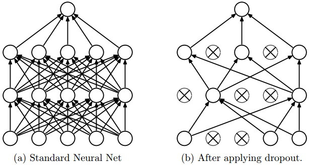
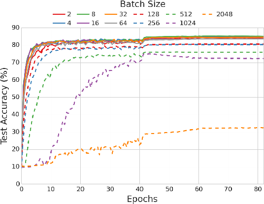
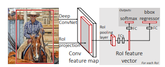
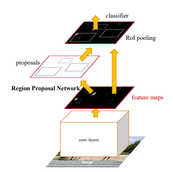
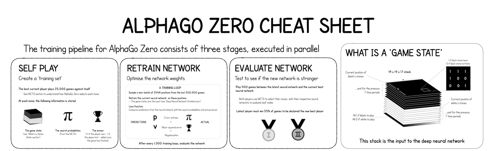
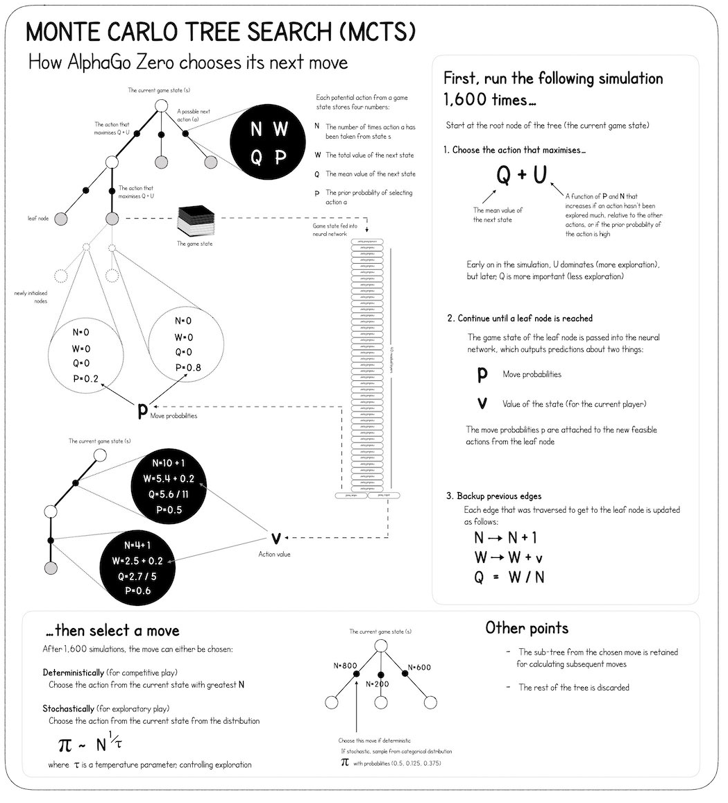
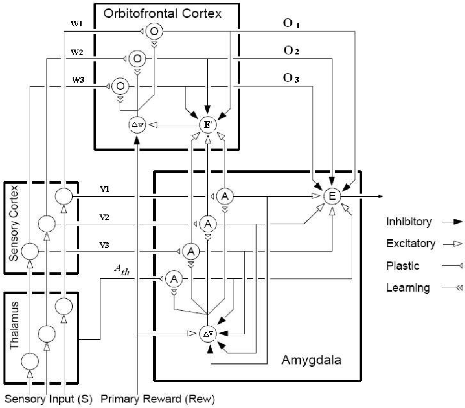
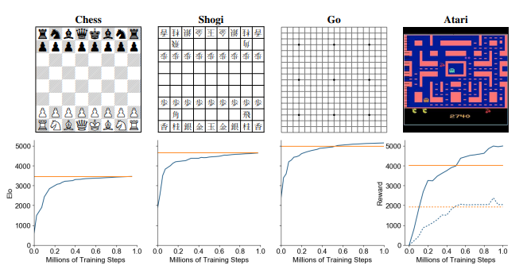
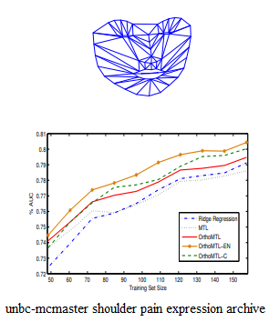

# Biomorphic AI

It’s known that a man has created many algorithms based on nature laws: genetic algorithms, algorithms of neural networks, swarm intelligence, etc.
The most effective methods of AI are effective simplification and modeling of processes in nature.
But, unfortunately, experts are often well versed in only a few models, when they read information from other articles they feel dizzy and they still remember only what is related to their topics.
In order for everyone to be able to discover such a complex topic as biomorphic AI, we offer a hierarchy format: topic → article → application → pros and cons.
To demonstrate how this works, we will show a description of the positive applications of linking algorithms with their biological roots.

Biomorphic AI
| Application | pros | cons |
|--------------------------------|:--------------------------------:|--------------------------------:|
| Consideration of several options for computational simplification of the original algorithm in compliance with their biological basis | Potential efficiency gains |Narrowing of scope is possible |
| Consideration of several options for how to make the algorithm more suitable for the biological basis | ability to model some biological processes; Improving the adaptability of the algorithm to "natural" data | Potential deterioration in efficiency |

## Smart technologies and recreation of biological processes

### Dropout
[Srivastava N, Hinton G, Krizhevsky A et al. (2014) Dropout: a simple way to prevent neural
networks from overfitting. J Mach Learn Res 15 (1):1929–1958](https://dl.acm.org/doi/10.5555/2627435.2670313)

| Application | pros | cons |
| -------------------------------- |:--------------------------------: | --------------------------------: |
| Dropout 20% - 30% of neurons | Efficiency rarely decreases and often rises | With strong overfitting, it may not give an optimal result |
| Dropout 30% - 50% of neurons | Strong overfitting can improve efficiency | Probability of a slight decrease in efficiency |

Many stable natural systems are based on unstable by themself elements. One of these systems is our brain and its work is based on the transmission of impulses between neurons.
In order to adapt such systems, a dropout algorithm was invented - the accidental deletion of neurons in an artificial neural network or elements in any other similar system. It helps to make the system more stable and, in the case of artificial neural networks, reduces overfitting with available data. The authors of this article compare the loss of neurons with the transfer of genes during sexual reproduction, as in reproduction only a certain part of genes is realized in the offspring. Let’s suppose that an individual had good traits, but these traits were determined by a large set of genes, or, in other words, a whole large coadaptation of genes. Then this complete set of genes, most likely, will not be passed on to the next genera. For generations, the offspring would undoubtedly contain only genes that play a positive role for humans, or small useful groups of genes.

Additional literature:

[H. Y. Xiong, Y. Barash, and B. J. Frey. Bayesian prediction of tissue-regulated splicing using RNA sequence and cellular context. Bioinformatics, 27(18):2554-2562, 2011.](https://academic.oup.com/bioinformatics/article/27/18/2554/182135)

### Small batch training
[Masters D, Luschi C (2018) Revisiting small batch training for deep neural networks](https://arxiv.org/pdf/1804.07612.pdf)

| Application | pros | cons |
| -------------------------------- |:--------------------------------: | --------------------------------: |
| A selection of 2-4 examples | Sometimes it can be more generalized; Sustainable Performance Compared to Other Use Cases | Greater increase in time per epoch; The risk of getting an unsatisfactory result |
| A selection of 4-16 examples | Usually has an optimum in learning time to convergence and an optimum in efficiency improvement | A slight increase in the time spent per era |
| A selection of 16+ examples | Less time per epoch; Sometimes, with not very sensitive data, it can give an optimal result | less stable result |

Artificial neural networks, unlike humans, have the ability to study all various information simultaneously, without intermediate performance tests. A person cannot do this, as he needs to apply the information he receives almost immediately. But this turns out to be even not bad: if the average indicators in a piece of information (sample) have small deviations from the global one, then they will not allow leaving the area of the global minimum error (corresponding to the complete information), but at the same time they will help to leave the area of local minima(which appear due to the presence of special noise in the input data).
This approach is called Small Batch Training.

For neural networks, it is optimal to choose from m = 2 to m = 32.

Small Batch Training can be seen in all of our training: 

organizing lessons in schools;
lectures and practices at universities;
online courses;

This one is very useful when there are random collective correlations in the data.

### Fast R-CNN
[Girshick R (2015) Fast R-CNN. In: The IEEE International Conference on Computer Vision
(ICCV), pp. 1440–1448.](https://arxiv.org/abs/1504.08083)

general cons: not the fastest method, complex architecture (more difficult to train together with other neural networks)
| Application | pluses | cons |
| -------------------------------- |:--------------------------------: | --------------------------------: |
| Localization of small objects | works well enough | |
| Localization of Medium Objects | works well enough | |
| Determining the boundaries of an object | works well enough | |

If we compare the neurophysiological structure of human hearing and vision with neural networks, then we can say that hearing is a sequential model of neural layers, which leads from sensors to the perception of such high concepts as, for example, musical harmony, on the other hand, information gets into the eyes and undergoes preliminary processing for the simplest signs begins to be further processed by two other neural networks - one which is responsible for determining what kind of objects in the picture, and the second determines where exactly these objects are located.
And now, moving away from the comparison and thinking about what is written, we see that this is fully consistent with Fast R-CNN.

### Faster R-CNN
[Ren S, He K, Girshick R, Sun J (2015) Faster R-CNN: Towards Real-Time Object Detection
with Region Proposal Networks. In: Advances in neural information processing systems, pp.
91–99.](https://arxiv.org/pdf/1506.01497.pdf)

general cons: slightly complex architecture (slightly more difficult to train with other neural networks)
| Application | pluses | cons |
| -------------------------------- |:--------------------------------: | --------------------------------: |
| Localization of small objects | | does not work very well |
| Localization of Medium Objects | works well enough | |
| Determining the boundaries of an object | | does not work very well |

When a person is focused or wants to quickly perceive the situation, he tries to peer into each changed piece of the image and quickly assess the position of new objects piece by piece and, having put the picture together, understand what is happening.
This approach is closer to Faster R-CNN.

### Recursive Cortical Network
[George D et al. (2017) A generative vision model that trains with high data efficiency and breaks
text-based CAPTCHAs. Science, 358(6368), art. no. eaag2612.](https://science.sciencemag.org/content/358/6368/eaag2612.full?ijkey=DmvGldXIEXVoQ&keytype=ref&siteid=sci)

| Application | pluses | cons |
| -------------------------------- |:--------------------------------: | --------------------------------: |
| Defining an Object Hierarchy | works well enough | works too long because of what it is ineffective to apply to real images |
| Object recognition from the object system | works well enough | works only for a system of simple objects |

The algorithm, unlike its predecessors, does not decrease the accuracy when deforming the text and almost does not decrease the accuracy when using various effects and styles to complicate the text and overlap it with other objects.

Thanks to him, he allowed to correctly guess Captha in 66.6% of cases, and after determining the style and additional training - in 90% of cases. Moreover, this network uses only 5000 examples of solved captcha examples and a small number of layers. Simulates the work of the primary visual cortex. A description of the work and experiments with this neural network is given in this article. Uses lateral communication between neurons to reveal more flexible patterns in information.

Additional literature:

[D. Kersten, A. Yuille, Bayesian models of object perception. Curr. Opin. Neurobiol. 13, 150–158 (2003).](https://pubmed.ncbi.nlm.nih.gov/12744967/)

[B. A. Olshausen, C. H. Anderson, D. C. Van Essen, A neurobiological model of visual attention and invariant pattern recognition based on dynamic routing of information. J. Neurosci. 13, 4700–4719 (1993).](https://www.jneurosci.org/content/13/11/4700.short)

[D. George, J. Hawkins, Towards a mathematical theory of cortical micro-circuits. PLOS Comput. Biol. 5, e1000532 (2009).](https://journals.plos.org/ploscompbiol/article?id=10.1371/journal.pcbi.1000532)

## Basic algorithms for a potential strong AI

### AlphaZero
[D. Silver, T. Hubert, J. Schrittwieser, I. Antonoglou, M. Lai, A. Guez, M. Lanctot, L. Sifre, D. Kumaran, T. Graepel et al., “Mastering chess and shogi by self-play with a general reinforcement learning algorithm,” arXiv preprint arXiv:1712.01815, 2017.](https://arxiv.org/abs/1712.01815)

| Application | pluses | cons |
| -------------------------------- |:--------------------------------: | --------------------------------: |
| Self-study of techniques in board games | brings out new playing techniques that people can learn from | The Difficulty of Perception Techniques for Non-Professionals |
| Learning Games That Simulate Utility Models | can provide new methods of competition and promotion | methods are difficult to fully understand |
| Games wins | Experience for world champions - competition with a very strong opponent, entertainment in the early stages | After constant victories AI entertainment falls |

In the beginning, there were algorithms that, according to some criteria, assessed the effectiveness of certain moves and thus determined the optimal one. To improve this estimate, a Monte Carlo tree algorithm was made - the algorithm, choosing randomly (but with preference for more optimal options), simulated several games by itself simultaneously determining which move would lead to a more optimal future and gradually building a tree from simple estimates of game positions (thus simulating human-like planning), this approach peaked at the level of the average go-lover.

Replacing the assessment of the position, which was made on the basis of the subjective understanding of Go players, with the assessment that is made using a convolutional neural network (or rather, a residual neural network) in DeepMind, they received AlphaGo, which later defeated the best player in Go.

Further improvement AlphaGo Zero, learned to learn not only on external data, but also playing with itself.
This not only got rid of her dependence on external data, but also significantly improved the program.

AlphaZero is a program that, learning from scratch, conquered all people and other algorithms in chess, shogi and go. AlphaZero can learn to play any game and become the best at it in a matter of hours. It adapts itself to the game, which makes it quite flexible and easily customizable for different types of games.

### BELBIC (Brain Emotional Learning Based Intelligent Controller)
[Beheshti Z et al. (2010) A Review of Emotional Learning And It’s Utilization in Control
Engineering. Int. J. Advance. Soft Comput. Appl., 2(2):191–208.](https://www.semanticscholar.org/paper/A-review-of-emotional-learning-and-it%27s-utilization-Beheshti-Hashim/ca26912ac89b2ebdf214083d72cfdccc903f0b6c)

| Application | pluses | cons |
| -------------------------------- |:--------------------------------: | --------------------------------: |
| Simulating Living Creatures | Good for simulating a small group of simple animals | describes the behavior of smart animals with difficulty; computationally difficult to simulate a large number of individuals |
| Emotion Modeling | Simulates the emotional reactions of animals and humans well | does not include planning for animals, let alone consciousness |
| Dynamic adaptation | Computationally small model | The need to combine with more stable algorithms |

Such mechanisms of our psyche as attention and emotions help us highlight the most important information in order to quickly analyze something or not overstrain us.
Emotional brain training models are called BEL (Brain Emotional Learning) models.
The most advanced of these models is the BELBIC model,
Such models themselves are interesting in that they simulate some part of the human limbic system and therefore can potentially have some similar internal rhythms, etc., but besides this, it is also a computationally efficient model for regulating the parameters of your control of drones and other equipment.

Additional literature:

[D. Shahmirzadi, Computational Modeling Of The Brain Limbic System And Its Application In Control Engineering, Master dissertation, Texas A&M University, U.S.A. , (2005).](http://i-csrs.org/Volumes/ijasca/vol.2/vol.2.2.3.July.10.pdf)

[J. Moren, C. Balkenius, "A Computational Model of Emotional Learning in the Amygdala", Cybernetics and Systems, Vol. 32, No. 6, (2000), pp. 611-636.](https://citeseerx.ist.psu.edu/viewdoc/download?doi=10.1.1.1.6046&rep=rep1&type=pdf)

[Package with BELBIC controller for Autonomous Navigation of AR.Drone. Github. Accessed at 22 February, 2020.](https://github.com/dvalenciar/BELBIC_Controller_ROS)

### MuZero

[Mastering Atari, Go, Chess and Shogi by Planning with a Learned Model](https://arxiv.org/pdf/1911.08265.pdf)

general cons: unstable training, in order to bring the level to the highest level, it is necessary to have a set of neural networks-players of an increasing level of complexity in order for the neural network itself to be able to gradually win one by one to reach the peak of a possible level
| Application | pluses | cons |
| -------------------------------- |:--------------------------------: | --------------------------------: |
| Self-study of techniques in any games | brings out new playing techniques that people can learn from | The Difficulty of Perception of Techniques for Non-Professionals |
| Use to obtain new drugs in medicine | high speed of work | The need for security and risk control |
| Use of computer or board games | Experience for world champions - competition with a very strong opponent, entertainment in the early stages | After constant victories AI entertainment falls |
| Simulation of Human Behavior | Teaches planning and learns to properly simplify your perception | The peculiarities of human emotions and behavior are not taken into account |
| Simulating Other Utility Models | can provide new methods of competition and promotion | methods are difficult to fully understand |

In order to understand what MuZero is, read about AlphaZero.
MuZero, unlike AlphaZero, is not tied to what data is submitted for input, MuZero must learn to compress information himself, this information is, relatively speaking, a subjective vision of reality by an algorithm.
This view of reality be in the hidden state - we can say that this is the digital equivalent of the hippocampus in humans.

Additional literature:

[Volodymyr Mnih, Koray Kavukcuoglu, David Silver, Andrei A Rusu, Joel Veness, Marc G Bellemare, Alex Graves, Martin Riedmiller, Andreas K Fidjeland, Georg Ostrovski, et al. Human-level control through deep reinforcement learning. Nature, 518(7540):529, 2015.](https://pubmed.ncbi.nlm.nih.gov/25719670/)

[Matej Moravcık, Martin Schmid, Neil Burch, Viliam Lisy, Dustin Morrill, Nolan Bard, Trevor Davis, Kevin Waugh, Michael Johanson, and Michael Bowling. Deepstack: Expert-level artificial intelligence in heads-up no-limit poker. Science, 356(6337):508–513, 2017.](https://arxiv.org/pdf/1701.01724.pdf)

[M.H.S. Segler, et al. Learning to plan chemical syntheses ArXiv (2017)](https://arxiv.org/pdf/1708.04202.pdf)

## Multi-task learning

###  Hierarchical Regularization Cascade

[Zweig A, Weinshall D (2013) Hierarchical Regularization Cascade for Joint Learning. In:
Proceedings of the 30 th International Conference on Machine Learning, Atlanta, Georgia,
USA, 2013.Part 2, pp. 1074–1082.](http://proceedings.mlr.press/v28/zweig13.html)
| Application | pluses | cons |
| -------------------------------- |:--------------------------------: | --------------------------------: |
| Defining a Property Hierarchy | prevents retraining, highlights the system in information | a little more time, the need for a preliminary initial grouping of tasks, the subjectivity of the allocated hierarchy of relations |
| Mutual improvement of the qualities of existing neural networks | Improved stability, potential efficiency gains | the need to find a neural network training on similar data |

In our life there are many areas and sub-areas of various tasks, some of these divisions are conditional, and some are not.
This algorithm tries to gradually select useful information on the basis of information, and it learns to understand where and in what area or task this or that information is useful, thereby reducing retraining and increasing the stability of the algorithm.

###  Convex Feature Learning

[Jawanpuria, P., & Saketha Nath, J., (2012) A Convex Feature Learning Formulation for Latent Task Structure Discovery.](https://arxiv.org/abs/1206.4611)
| Application | pluses | cons |
| -------------------------------- |:--------------------------------: | --------------------------------: |
| Defining a Property Hierarchy | prevents retraining, completely independently selects the system in the information | more time, the subjectivity of the distinguished hierarchy of relations |
| Separating Features in a Hierarchy | the presence of a clear graph indicating the hierarchy; The ability to effectively retrain the algorithm for a new distraction without rebuilding the hierarchy | Complexity of Effective Extension of the Algorithm for a Large Number of New Problems |

Sometimes there is no clear hierarchy in task topics, but there are interdependencies. Trying to search for them and highlighting the graph, you can get your own subjective and effective hierarchy of task topics.

Additional literature:

[Widmer, C., Toussaint, N., Altun, Y., and Ratsch, G. Inferring latent task structure for multi-task learning by multiple kernel learning. BMC Bioinformatics, 11:S5, 2010.](https://bmcbioinformatics.biomedcentral.com/articles/10.1186/1471-2105-11-S8-S5)

###  Exploiting Unrelated Tasks

[Romera-Paredes et al. (2012) Exploiting Unrelated Tasks in Multi-Task Learning. Proceedings
of the Fifteenth International Conference on Artificial Intelligence and Statistics, PMLR
22:951-959](http://proceedings.mlr.press/v22/romera12.html)

| Application | pluses | cons |
| -------------------------------- |:--------------------------------: | --------------------------------: |
| Mutual improvement of the qualities of existing neural networks | Improved stability, potential efficiency gains | Due to penalties for similarly solving problems from different groups, strong interrelationships between groups of problems can disrupt the algorithm |

Sometimes in life we have to take on incoherent tasks, but by learning to plan and competently separate and organize our mental processes, we can potentially learn to solve our old tasks even more stably and efficiently.
