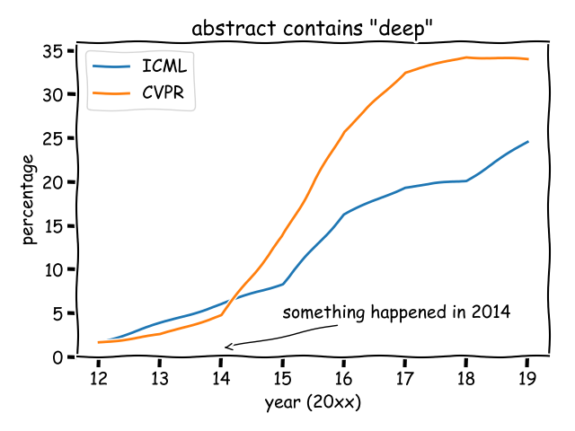

# A Story About Transfer Learning

A common belief is that deep learning was popularized when AlexNet won the ImageNet competition. Indeed AlexNet was a huge breakthrough, but something else played a very important role, too.

To understand the hidden factors, I analyzed CVPR (a top-tier conference for computer vision) and ICML (a top-tier conference for machine learning). I calculated the proportion of papers whose abstract contain the word “deep”, from 2012 to 2019.



Prior to 2012, just a few papers (basically from Hinton's group) mentioned "deep". After AlexNet in 2012, the percentage started to go up. However, few people noticed that, **there is another turning point in 2014**, when the percentage started to grow rapidly.

What happened in 2014? After a literature survey, I believe the following papers played an important role:

- Rich feature hierarchies for accurate object detection and semantic segmentation, CVPR 2014, citation over 1.5w
- Decaf: A deep convolutional activation feature for generic visual recognition, ICML 2014, citation over 4k

The first paper is the RCNN paper, which demonstrated that **features from pre-trained AlexNet could greatly benefit object detection and semantic segmentation**. The second paper demonstrated that **features from pre-trained AlexNet could benefit generic visual classification problems**. Both of them extended the power of pre-trained AlexNet to downstream tasks, showing how deep neural networks can be transferred to benefit broad tasks.

Therefore, transfer learning is the hidden force behind deep learning.

# The Status Quo of Transfer Learning

When we talk about transfer learning, we mean the practice of fine-tuning pre-trained models to a new target dataset. 

The fine-tuning pipeline (in the figure below) is extremely simple. In computer vision, practitioners often choose an ImageNet pre-trained model, remove the last fully connected layer, add a randomly initialized layer, and then start fine-tuning. Intuitively, the last fully-connected layer is task-specific, and cannot be reused in a new task. So **the status quo of transfer learning is simply to copy pre-trained weight as initialization**.


It is straightforward to copy the weight of bottonm layers. But, **can we further re-use the top fc layer?** Actually, after counting the percentage of parameters in the discarded fc layer, I found that they took up a decent amount of total parameters! For popular NLP models like BERT, **the fc layer can take up to 21% of total parameters**!


# Re-use the Discarded FC Layer to Improve Transfer Learning

I will directly dive into the code implementation to explain the idea behind the paper. A figure is also available in the below to illustrate the procedure.


Say we have an input dataset ${\{x_i\}}_{i=1}^n$. By feeding the dataset into a pre-trained model ($F_{\bar{\theta}}$), we can get features ${\{f_i\}}_{i=1}^n$. Typically this is the end of transfer learning: the final fc layer ($G_{\theta_s}$) of the pre-trained model is discarded and the features are fed into a randomly initialized fc layer ($H_{\theta_t}$) to get predictions ${\{\hat{y}^t_i\}}_{i=1}^n$ (we use subscript/superscript "t" to denote target dataset, and use "s" to denote the source/pre-training dataset). Then the labels from target dataset ${\{{y}^t_i\}}_{i=1}^n$ can supervise the predictions to calculate the loss function needed for training neural networks. That's the whole story of naive fine-tuning.

Since we notice that $G_{\theta_s}$ takes a large proportion of parameters, we propose a way to re-use $G_{\theta_s}$. 

First, we can feed the features ${\{f_i\}}_{i=1}^n$ into $G_{\theta_s}$ to get output ${\{\hat{y}^s_i\}}_{i=1}^n$. The target prediction ${\{\hat{y}^t_i\}}_{i=1}^n$ is supervised by the target labels ${\{{y}^t_i\}}_{i=1}^n$, then how about the source prediction ${\{\hat{y}^s_i\}}_{i=1}^n$? In the common case of ImageNet pre-trained models, the output space of $\hat{y}^s$ is a 1000-class categorical distribution. Therefore, **if somehow we figure out a 1000-dimentional vector to supervise ${\{{y}^t_i\}}_{i=1}^n$, we can re-use the previously discarded fc layer!**

How to find the supervision? It seems very difficult, but remember we have target label ${\{{y}^t_i\}}_{i=1}^n$ for each data point, therefore we can convert the target label $y^t$ into another form $y^s$ to supervise the output ${\{\hat{y}^s_i\}}_{i=1}^n$ for another branch $G_{\theta_s}$! The conversion is shown as the "Category Relationship" in the figure, and is easy to calculate despite the scary formula in the paper. Actually, it only requires 7 lines! See the below code.

```python
def category_relationship(pretrain_prob, target_labels):
    """
    The direct approach of learning category relationship.
    :param pretrain_prob: shape [N, N_p], where N_p is the number of classes in pre-trained dataset
    :param target_labels:  shape [N], where 0 <= each number < N_t, and N_t is the number of target dataset
    :return: shape [N_c, N_p] matrix representing the conditional probability p(pre-trained class | target_class)
     """
    N_t = np.max(target_labels) + 1 # the number of target classes
    conditional = []
    for i in range(N_t):
        this_class = pretrain_prob[target_labels == i]
        average = np.mean(this_class, axis=0, keepdims=True)
        conditional.append(average)
    return np.concatenate(conditional)
```

That said, the procedure of Co-Tuning is very simple:

- Feed the target dataset into the pre-trained model, collect the target labels and probabilistic outputs from the pre-trained model.
- Calculate the category relationship ``relationship=category_relationship(pretrain_prob, target_labels)`` by the above code.
- Use simple indexing ``y_s = relationship[y_t]`` to get the "label" for the output of $G_{\theta_s}$.

This is a simplified version of my NeurIPS 2020 paper [Co-Tuning for Transfer Learning](https://proceedings.neurips.cc//paper/2020/file/c8067ad1937f728f51288b3eb986afaa-Paper.pdf). For more details, check the paper yourself or check the code repository [https://github.com/thuml/CoTuning](https://github.com/thuml/CoTuning). The paper contains many sophisticated techniques to further improve Co-Tuning, but I think this post is enough for readers to get the main idea.

# Experimental Results

We present parts of the experimental results in the below. Compared to baseline fine-tune (naive transfer learning), the Co-Tuning method can greatly improve the classification performance, especially when the proportion of available data (sampling rates) is small.


In Stanford Cars dataset with sampling rate of 15%, baseline fine-tuning accuracy is 36.77% and Co-Tuning improves the accuracy to 46.02%, bringing in **up to 20% relative improvement**!

# Reference

[Co-Tuning for Transfer Learning](https://proceedings.neurips.cc//paper/2020/file/c8067ad1937f728f51288b3eb986afaa-Paper.pdf), NeurIPS 2020

