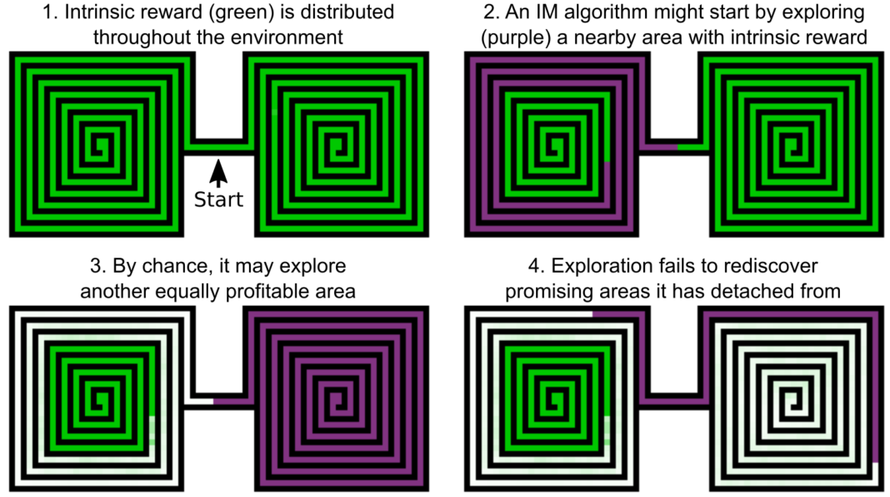
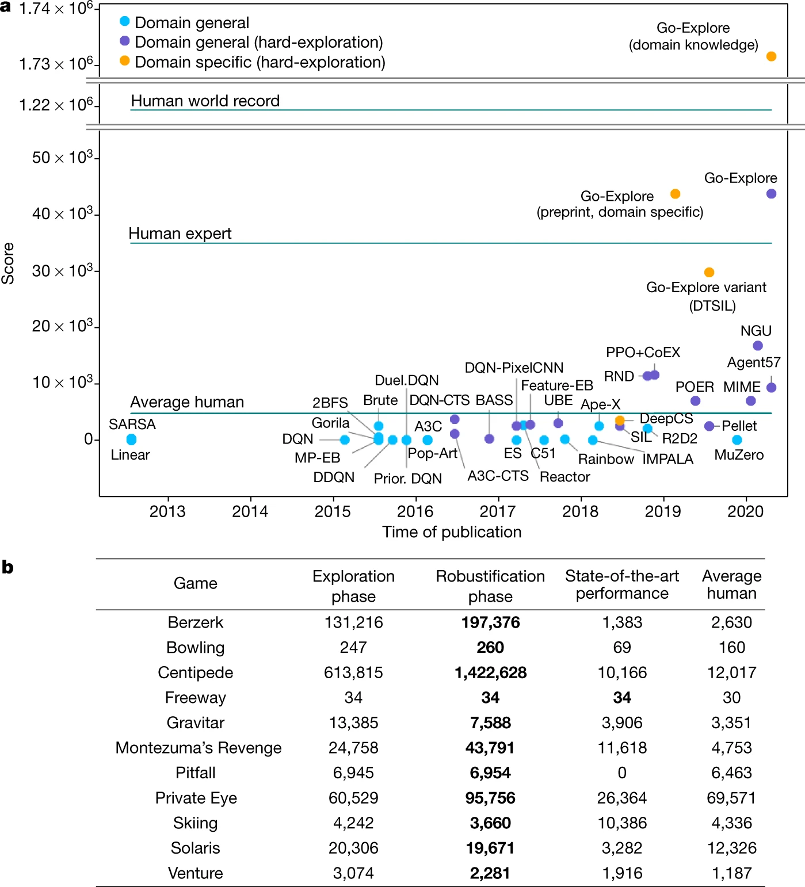
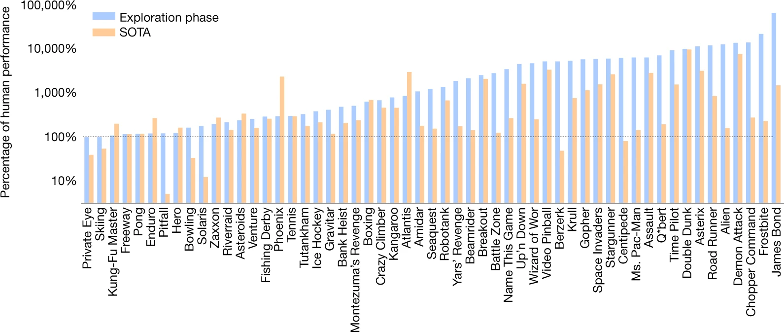

# Summary

Deep reinforcement learning has demonstrated super-human level performance. However, hard-exploration problems remained unsolved due to their sparse and deceptive feedback. A new family of reinforcement learning algorithms, Go-Explore, surpasses all previous approaches on hard-explore Atari games by addressing detachment and derailment.

# Introduction

The 2015 paper [Human-level control through deep reinforcement learning [1]](https://www.nature.com/articles/nature14236) revolutionised the field of reinforcement learning (RL). Combining deep neural networks to standard RL algorithms showed that deep reinforcement learning could reach super-human level performance. The paper introduced deep neural networks to predict the Q-value in the traditional Q-learning algorithm. The deep Q-network (DQN) surpassed human scores in 23 out of 49 games in the Atari game suite. 

Atari games that were not solved by DQN were mostly in the hard-explore category. In those games, rewards are sparse which makes it hard for the algorithm to pinpoint which actions contributed positively. This is the credit assignment problem [2]. It can also take a precise long sequence of actions to reach any positive reward. Given a large enough action and state space it may be very rare to find any positive reward with a random policy.

The second aspect of hard-explore games are deceptive rewards. Those are rewards (negative or positive) which do not reflect the true quality of a state-action pair. For example, in the Atari game Pitfall it is necessary to go over ferocious crocodiles to improve one's score. One must also time one's jumps to walk on the crocodiles without being eaten. A newly initialised policy will most likely incur negative rewards from going near the crocodiles even though it is the only path forward. In the case of DQN, the agent would mistakenly learn that not moving is the best policy.

Montezuma’s Revenge is one of those hard-explore games where the player must, among other obstacles, find a key to go to the next level. In this game the original DQN scored zero points and, until the 2021 "First return, then explore" Nature paper that introduced Go-Explore [3], the state-of-the-art algorithms scored around an average human player. 

# The challenge of exploration

To encourage exploration in hard-explore scenarios, intrinsic motivation (IM) [4] can be introduced. This rewards the agent for going to new states. One way to achieve this is through curiosity by introducing an episodic memory to save visited states. Rewards are then given to the agent for reaching states not in memory [5]. 

Detachment is a phenomenon that arises from IM and curiosity-driven algorithms. The agent may discover a promising area, explore a subset of the new states, and move away with no memory of the remaining profitable states. This great illustration below has been taken from the [Uber engineering blog where Go-Explore algorithms were first discussed](https://eng.uber.com/go-explore/) in 2018.

A second pitfall (Pitfall is also a hard-explore Atari game solved by Go-Explore) of those techniques is that they can reward the agent for exploring the environment instead of achieving the actual task. In a [Large-Scale Study of Curiosity-Driven Learning [6]](https://pathak22.github.io/large-scale-curiosity/), the agent stopped and started watching a TV placed in the maze to maximise its surprise (and reward) as channels were changed randomly.

Supposing the agent finds the right sequence of actions to reach a key state for its task, most exploration mechanisms will hinder the return to this state in future episodes. For instance, an $\epsilon$-greedy policy takes random actions with probability $\epsilon$. Any non-optimal action may prevent the agent to reach again the key state from which to further explore. This is the derailment problem.

# Go-Explore algorithm

The Go-Explore [6] algorithm directly tackles the detachment and derailment exploration problems. States which yielded high rewards and that have not been visited often are sampled as starting exploration points. Contrary to previous approaches, Go-Explore merely and solely explores from that chosen state onwards, for example by taking random actions. To reach the chosen state, it either:
- loads the state from memory if the environment is resettable
- replays the trajectory up to that state if the environment is deterministic
- uses a goal-conditioned policy trained with self-imitation learning if the environment is stochastic (called the robustification phase)

  
This prevents derailment by removing exploration before the chosen state. Also, if the agent detaches from a promising area, those states will have a high chance to be sampled again for more exploration. Thus, the agent does not "forget" about them.

Storing all states encountered during training is not possible in most Atari games and any sophisticated environment. The authors decided to reduce the state space by down-sampling and grey-scaling the game frames. This works for visually poor environments where small details in the frames do not change drastically the value of the state. Another approach discussed but not shown in the paper is to use learned representations.

The conceptually simple algorithm achieves state-of-the-art and, most importantly, super-human scores in hard-explore Atari games. The figure a below (from the Go-Explore paper [6]) shows the state-of-the-art algorithm's scores in Montezuma’s Revenge. Figure b is a table of scores for multiple hard-explore Atari games.

In addition to solving hard-explore Atari games, Go-Explore achieves higher score than state-of-the-art approaches in most Atari games. This could hint that efficient exploration is crucial even in "easy-explore" tasks. 

# Conclusion

Multiple exploring challenges such as derailment and detachment have been identified to be the cause of reinforcement learning failures in hard-explore environments. Solving them has been the driving motivation of Go-Explore algorithm which exceeds expert human performances in hard-explore games. The conceptually simple algorithm paves the way for new research in that direction. 

# References 

[1] Mnih, V., Kavukcuoglu, K., Silver, D. et al. Human-level control through deep reinforcement learning. Nature 518, 529–533 (2015).
[2] Sutton, R.S., 1985. Temporal Credit Assignment in Reinforcement Learning.
[3] Ecoffet, A., Huizinga, J., Lehman, J., Stanley, K.O. and Clune, J., 2021. First return, then explore. Nature, 590(7847), pp.580-586.
[4] Singh, S., Barto, A.G. and Chentanez, N., 2005. Intrinsically motivated reinforcement learning. MASSACHUSETTS UNIV AMHERST DEPT OF COMPUTER SCIENCE.
[5] Savinov, N., Raichuk, A., Marinier, R., Vincent, D., Pollefeys, M., Lillicrap, T. and Gelly, S., 2018. Episodic curiosity through reachability. arXiv preprint arXiv:1810.02274.
[6] Burda, Y., Edwards, H., Pathak, D., Storkey, A., Darrell, T. and Efros, A.A., 2018. Large-scale study of curiosity-driven learning. arXiv preprint arXiv:1808.04355.
