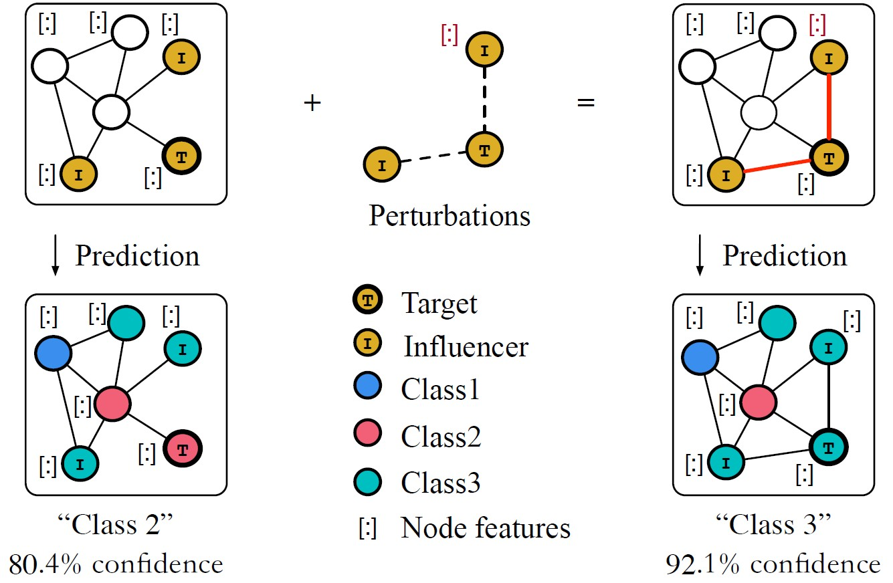

# Introduction

Graph Neural Networks (GNNs) have received a considerable amount of attention in recent years, which has achieved excellent performance in many graph analysis tasks such as node classification, link prediction, and graph clustering. However, more and more researches have pointed out the *vulnerability* of GNNs, that is, they are easily affected by several well-designed inputs. As shown in Fig.1, slightly modifying the existence of either edges or nodes may lead to the wrong prediction of the target node. Such unreliable results provide the opportunity for attackers to exploit these vulnerabilities and restrict the applications of GNNs.

<em>Fig. 1. A misclassification of the target caused by a small perturbations of the graph structure and node features</em>

To resist such attacks, multiple methods have been explored in the literature including adversarial training[1], transfer learning[2], employing Gaussian distributions to represent nodes[3], recovering potential adversarial perturbations[4], and allocating reliable queries. Accordingly, there are a line of studies proposed to further exploit the vulnerabilities of GNNs[7-10], leading to the arms race in graph adversarial
learning.

In this review, we begin by providing an overview of adversarial machine learning on the graph, followed by several new open problems towards this area.

# Graph Adversarial Learning
## Adversarial Attack on Graph
First, we begin by providing some preliminary knowledge on how attacker works on graph data. According to [11-12], attacks on graphs can be categorized into different types based on different perspectives. Here we will briefly introduce some of the main categories.

+ **Poisoning and Evasion Attack**. Poisoning attack (a.k.a training-time attacks) means an attack occurred in the training stage, which tries to affect the performance of the targeted system (e.g., a GNN) by adding adversarial samples into the training dataset. In contrast, Evasion attack (a.k.a test-time attacks) means the target system is trained on a clean graph and tested on a perturbed one.

+ **Targeted and Untargeted Attack**. The adversarial goal of an untargeted attack is to destroy the performance of GNNs on most of the instances, while the targeted attack aims to reduce the performance of some target instances.

+ **Black-, Grey-, and White-box Attack**. This type of attack is characterized based on different levels of knowledge that attackers accessed. The information of attackers would receive is increasing from black-box attack to white-box attack.

Unlike, e.g., images consisting of continuous features, the graph structure – and often also the nodes’ features –- is discrete. It is difficult to design efficient and effective algorithms to cope with the underlying discrete domain. The first work of adversarial attack on graph data is proposed by Zügner et al.[6]. An efficient algorithm named *Nettack* was developed based on a linear GCN[13]. Specifically, the output of a GCN with one hidden layer can be formulated as follows:
$$
Z=f_{\theta}(A, X)=\operatorname{softmax}\left(\hat{A} \sigma\left(\hat{A} X W^{(1)}\right) W^{(2)}\right)
$$
where $A$ is the adjacency matrix, $\hat{A}$ is normalized Laplacian matrix, $X$ is node feature matrix, $\sigma$ is activation function and $W$ is trainable weights of GCN.

*Nettack* drops the non-linear activation (e.g., ReLU) in the hidden layer, so as to efficiently compute the perturbed output of $\hat{Z}$ as one edge or one node's features has changed. *Nettack* computes all possible changes of the attack on a targeted node and chose the best perturbations within given budgets. It has been proved effective in attacking other GNNs except for GCN, even under a black-box attack setting.

In the following works, gradient-based methods have been widely used to find the optimal perturbations on the graph. Dai et al. adopt a surrogate model, such as GCN to compute the gradients of training loss w.r.t. the input graph. They choose the adversarial edge with the largest magnitude of gradients and flip it. Gradient-based methods are easy but effective in attacking GNNs, however, it takes much memory since computing the gradients of the adjacency matrix is costly, approximating $O(N^2)$ where $N$ is the number of nodes in the graph.

To address this problem, this work [14] proposed a *simplified gradient-based attack (SGA)*. As the main property of GNNs lies in aggregating messages from the node and its neighborhoods, attacking a targeted node could be simplified with its $k$-hop neighbors, where $k$ depends on the receptive fields of GNNs. The authors also use a simplified GCN (namely SGC[15]) as a surrogate model, which can be formulated as follows
$$
Z=f_{\theta}(A, X)=\operatorname{softmax}\left(\hat{A}^2 X W\right)
$$

This is a two-layer SGC and the computation of $\hat{A}^2 X$ could be done before training, which simplifies the training of GCN. Based on SGC and $two$-hop subgraph of the targeted node, SGA achieves much more efficiency than *Nettack* and other gradient-based methods. SGA only works for targeted attack, there lacks a more efficient algorithm for the untargeted attack.

## Adversarial Defense on Graph
With graph data, recent intensive studies on adversarial attacks have also triggered the research on adversarial defenses. According to [11-12],  the defense methods are classified into three popular categories. 

+ **Adversarial Training**. While adversarial training has been widely used by attackers
to perform effective adversarial intrusion, the same sword can be used by defenders to improve the robustness of their models against adversarial attacks. That is, the model will be trained on a clean graph as well as perturbed graphs, where the perturbed graphs are generated by several representative attacks. In this way, the learned graph model is expected to be resistant to future adversarial attacks.

+ **Adversarial Detection**. Adversarial detection methods usually work as preprocessing methods on the graph. Instead of generating adversarial attacks during training, another effective way of defense is to detect and remove (or reduce the effect of) attacks, under the assumption that data have already been polluted.

+ **Robust Optimization**. These methods employ a robust optimization strategy, which is not sensitive to extreme embeddings, to train the graph model. They often use a more robust aggregation function of GNNs to improve the robustness.

Adversarial learning on graph data is first studied by Xu et al.[1] by solving a min-max problem:
$$
\min _{\theta} \max _{\hat{G}} \sum_{i} \mathcal{L}\left(f_{\theta}\left(v_{i}, \hat{G}\right), y_{i}\right)
$$
where $\hat{G}$ denotes the perturbed graph, $v_i$ denotes the node and $y_i$ is the corresponding class label. The perturbed graph is generated by a gradient-based attack algorithm, and it truly enhances the robustness of GNNs.

However, adversarial learning can only defense against evasion attacks, they are still strongly affected by poisoning attacks. To this end, adversarial detection methods have been proposed. Wu et al.[4] observe that the adversarially manipulated graph differs from normal graphs statistically. For example, attackers tend to link dissimilar nodes and dislink similar nodes to destroy the message passing mechanism of GNNs. The authors propose to recovers the potential adversarial perturbation by Jaccard Similarity between nodes connected in the graph. Detection methods are simple but effective to resist adversarial attacks especially poisoning attacks, many works adopt this strategy to *purify* the graph.

Rather than direct detection of suspicious nodes or edges before training, Zhu et al.[3] designed a more robust GCN, which dynamically uncovers and down-weigh suspicious data during training with an attention mechanism.

## Robustness Certification on Graph 
Robustness of the graph model is always the main issue among all the existing works including attack and defense mentioned above. Therefore certificate the node’s absolute robustness under arbitrary perturbations is important.

The certification problem on a graph could be formulated as follows:
$$
\begin{aligned}
m^{t}\left(y^{*}, y\right):=& \operatorname{minimize}_{\tilde{X},\tilde{A}} f_{\theta}^{t}(\tilde{X}, \tilde{A})_{y^{*}}-f_{\theta}^{t}({X}, {A})_{y} \\
& \text { subject to } \tilde{X} \in \mathcal{X}_{q, Q}({X}),  \tilde{A} \in \mathcal{A}_{q, Q}({A})
\end{aligned}
$$
where $m^{t}\left(y^{*}, y\right)$ is the margin of prediction for target instance $t$ between true label $y$ and others $y^*$, $\mathcal{X}_{q, Q}({X})$ and $\tilde{A} \in \mathcal{A}_{q, Q}({A})$ are the allowed perturbation space w.r.t. $X$ and $A$. if $m^{t}\left(y^{*}, y\right) \gt 0,\  \forall y\neq y^* $, the model $f$ is certifiably robust. Most importantly, if a node has been certified, it is guaranteed to be robust under any possible perturbation given the attack model

Zügner et al.[16] propose the first method for certifiable (non-)robustness of graph convolutional networks with respect to perturbations of the node features. They relax the GNN and considering the dual problem to find the possible perturbations, but the method is only available for attacks on node features. Recently, many works have been proposed and solved such a problem[17-20].

## Evaluation Metrics
Evaluation of the attack/defense performance is important to assess the algorithms. Here we  give an introduction
of particular evaluation metrics designed for attacks and defenses.

+ **Attack Success Rate (ASR)**. ASR is the ratio of successful attacks within a given fixed budget. Correspondingly, we can conclude the formulation of ASR:
$$
\mathrm{ASR}=\frac{\# \text { Successful attacks }}{\# \text { All attacks }}
$$

+ **Average Modified Links (AML)**. AML is a kind of modification budget. It describes the average number of
modified links the attacker needed to meet the attack objective:
$$
\mathrm{AML}=\frac{\# \text { Modified links }}{\# \text { All attacks }} 
$$

+ **Averaged Worst-case Margin (AWM)**. Worst-case Margin (WM) is the minimum of the Classification Margin (CM), and the average of WM is dynamically calculated over a mini-batch of nodes during training. 

+ **Average Defense Rate (ADR)**. ADR[16] is the ratio of the difference between the ASR of the attack on GNNs with and without defense, versus the ASR of the attack on GNNs without defense. The higher ADR the better defense performance.
$$
\mathrm{ADR}=\frac{\text { ASR }_{\mathcal{V} \text { attacked }}^{\text {with-defense }}}{\text { ASR }_{\mathcal{V}^{\text {wittacked }}}^{\text {without-defense }}}-1
$$

For the sake of brevity, we only introduce several important metrics frequently adopted in this area, and there are more practical evaluation metrics to be developed[11].

# Real-World Example 
So far, the research on graph adversarial learning is just emerging and has no practical application yet. Nevertheless, it is a promising field and has many potential application scenarios, such as *recommender system*, where the user-item relationship can be modeled as a graph. By injecting some fake users into the system to promote some goods/items or maliciously constructing a co-vision graph, a malicious attacker can easily destroy the system. This is refer to *data poisoning attack* or *promotion/demotion attack*[26-30]. Fig.2 is an example of an attacker constructing a co-vision graph to mislead the recommendation and promote/demote certain products.

<em>Fig. 2.  A small perturbations on co-vision graph to mislead the recommendation and promote/demote certain products.</em>

# Open Problems
So far, there are more than 190 works towards this area[21]. Despite a surge of works on the graph adversarial learning, there still exist several problems to solve.
 + **Benchmarking Tools**. For benchmarking GNN models, there are several tools such as PyG[22], DGL[23]. For adversarial learning on image domain, there are foolbox[24], cleverhans[25]. However, implementing new methods towards the area is tedious, there should be more toolboxes being developed.
 + **Scalability**. Most of the attacks are time-consuming and need a large of memory, the researchers often study on a rather small graph. However, million-scale or even larger graphs are commonly seen in real life, and efficient attacks on the larger graph are leaving unexplored. Besides, the defense methods such as adversarial training take much long resource to train a robust model, which also needs to be improved.
 + **Knowledge**. It is common to assume that attackers have the entire knowledge of the dataset, but it is unreasonable and impractical due to the limited access of the attacker.
 + **Unnoticeablity**. Attackers often assume that the attack is unnoticeable as if the modification is small, they simply consider the lower attack budgets but far from enough instead. However, different edges in the graph have different importance. To be more concealed, attackers should focus more on their perturbation impacts on a target graph, with more constraints placed on the attacks.
 + **Feasibility**. Modification on a graph is not always feasible. In most cases, adding an edge is more costly than removing an edge, e.g., in a recommender system, an edge denotes that a user has purchased a product/item. Thus attackers or defenders usually are not allowed to remove such connections.
  + **Interpretability**. Although multiple works have been proposed to improve their robustness against such structural adversarial attacks, the reasons for the success of the attacks remain unclear. there still lacks in-depth research that gives a better understanding of the vulnerability of GNNs.
 Besides the open problems mentioned above, there are still many interesting problems that deserve more research attention in this area, such as the stability of GNNs, more unnoticeable backdoor attacks, etc.

# Conclusion
GNNs are vulnerable to adversarial attacks on the graph. we begin by giving an review of adversarial machine learning on graph, from the perspectives of attack, defense, robustness certification and evaluation metrics, followed by several problems of this area that worth exploring. Hopefully, this review can provide a comprehensive overview and offer insights for the relevant researchers

# Reference

[1] Xu K, Chen H, Liu S, et al. Topology attack and defense for 
graph neural networks: An optimization perspectiv[C]. IJCAI, 2019.

[2] Tang X, Li Y, Sun Y, et al. Transferring robustness for graph 
neural network against poisoning attacks[C]. WSDM, 2020.

[3] Zhu D, Zhang Z, Cui P, et al. Robust graph convolutional 
networks against adversarial attacks[C]. KDD, 2019.

[4] Wu H, Wang C, Tyshetskiy Y, et al. Adversarial examples on 
graph data: Deep insights into attack and defense[C]. IJCAI, 2019.

[5] Zhou K, Michalak T P, Vorobeychik Y. Adversarial robustness 
of similarity-based link prediction[C]. ICDM, 2019.

[6] Zügner D, Akbarnejad A, Günnemann S. Adversarial attacks on 
neural networks for graph data[C]. KDD, 2018.

[7] Zügner D, Günnemann S. Adversarial attacks on graph neural 
networks via meta learning[C]. ICLR, 2019.

[8] Li J, Zhang H, Han Z, et al. Adversarial attack on community 
detection by hiding individuals[C]. WWW, 2020.

[9] Zügner D, Borchert O, Akbarnejad A, et al. Adversarial 
attacks on graph neural networks: Perturbations and their patterns
[J]. TKDD, 2020.

[10] Zhang Z, Zhang Z, Zhou Y, et al. Adversarial Attacks on Deep 
Graph Matching[J]. NeurIPS, 2020.

[11] Chen L, Li J, Peng J, et al. A survey of adversarial 
learning on graphs[J]. arXiv preprint arXiv:2003.05730, 2020.

[12] Wang S, Chen Z, Ni J, et al. Adversarial defense framework 
for graph neural network[J]. arXiv preprint arXiv:1905.03679, 
2019.

[13] Thomas N. Kipf and Max Welling. Semi-Supervised 
Classification with Graph Convolutional Networks[C]. ICLR 2017.

[14] Li J, Xie T, Chen L, et al. Adversarial attack on large 
scale graph[J]. arXiv preprint arXiv:2009.03488, 2020.

[15] Wu F, Souza A, Zhang T, et al. Simplifying graph 
convolutional networks[C]. ICLR, 2019: 6861-6871.

[16] Zügner D, Günnemann S. Certifiable robustness and robust 
training for graph convolutional networks[C]. KDD, 2019.

[17] Ding D, Zhang M, Pan X, et al. Improving the Robustness of 
Wasserstein Embedding by Adversarial PAC-Bayesian Learning[C]. 
AAAI, 2020.

[18] Jin H, Shi Z, Peruri A, et al. Certified Robustness of Graph 
Convolution Networks for Graph Classification under Topological 
Attacks[J]. NeurIPS, 2020.

[19] Zügner D, Günnemann S. Certifiable robustness of graph 
convolutional networks under structure perturbations[C]. KDD, 
2020.

[20] Gao Z, Hu R, Gong Y. Certified Robustness of Graph 
Classification against Topology Attack with Randomized Smoothing
[C]. NeurIPS, 2020.

[21] https://github.com/gitgiter/Graph-Adversarial-Learning

[22] https://github.com/rusty1s/pytorch_geometric

[23] https://github.com/dmlc/dgl

[24] https://github.com/bethgelab/foolbox

[25] https://github.com/cleverhans-lab/cleverhans

[26] Yang G, Gong N Z, Cai Y. Fake Co-visitation Injection Attacks to Recommender Systems[C]. NDSS, 2017.

[27] Liu Z. Adversarial Item Promotion: Vulnerabilities at the Core of Top-N Recommenders that Use Images to Address Cold Start[J]. arXiv preprint arXiv:2006.01888, 2020.

[28] Lin C, Chen S, Li H, et al. Attacking Recommender Systems with Augmented User Profiles[C]. CIKM, 2020.

[29] Wadhwa S, Agrawal S, Chaudhari H, et al. Data Poisoning Attacks against Differentially Private Recommender Systems[C]. SIGIR, 2020.

[30] Zhang H, Li Y, Ding B, et al. Practical Data Poisoning Attack against Next-Item Recommendation[C]. WWW, 2020.

