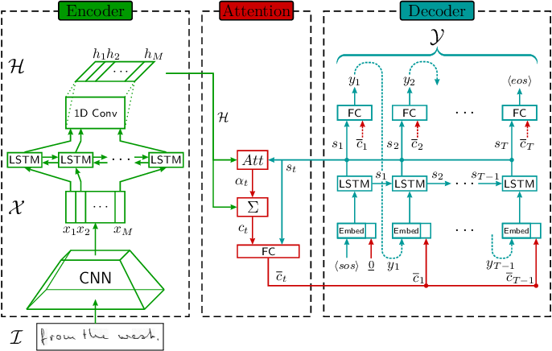

# Introduction
Optical Character Recognition (OCR) is a broad research domain in Pattern Recognition and Computer Vision. OCR electronically converts printed or handwritten text image into a format that machines can recognize. OCR is classified into: (i) offline text recognition, and (ii) online text recognition. If a static text article is scanned and then understood by the computer, it is called offline text recognition. If the text is recognized while writing through a touchpad using a stylus pen, it is called online text recognition. Offline Text Recognition is then further divided into subcategories depending on whether the articles are typed or handwritten. Processing and detecting text from the static handwritten documents is called <b>Handwriting Text Recognition</b> (HTR). HTR is regarded a subfield of OCR and is considered one of the most challenging research problems in image processing and pattern recognition. In this review paper, we summarize the latest research in offline handwriting recognition on documents.

# Use cases
The field of handwriting recognition has achieved significant real-world successes in targeted applications. HTR has use cases in Health and Pharmaceuticals, Insurance, Banking, etc.  A premier example of HTR that we discovered; deciphering a doctor's handwriting and who will be benefitting from it? - A large supplemental insurance provider based in the US [7] faced challenges in extracting vital information from a doctor's handwritten notes that accounted for 20% of the entire documents. Following a manual sifting process through the documents to decide on the claims payout, they elected to automate the process because it took five to six days to approve the claim. As part of the process, they built a solution with [Amazon Web Services (AWS)](https://aws.amazon.com) to extract printed and handwritten text from several supporting documents to verify the claim. The solution extracted information from handwritten text from several supporting documents to verify the claim and reduced manual intervention by over 70%. However, the accuracy was low and required human intervention to validate the information, impacting process efficiency.

# Challenges
Below we list some of the major challenges in the HTR task

+ Various algorithms have been designed, and several approaches have been proposed to solve the research problem of handwritten character recognition, but accurate detection is still a challenging issue due to a variety of text appearances and style variations such as cursive, block lettering.
+ Poor Quality and Poor Inking are some of the other factors that determine the rate of detection accuracy.
+ Latest approaches for the HTR task include the usage of deep neural networks. These models take time to train the input data. As the complexity and model size of these deep neural networks increases, the time taken to process multiple images and the detection time increases. OCR is still a challenging task due to this demand for computational efficiency.
+ Development of scalable detection algorithms that can detect the expanding data properly is another key challenge of handwritten character recognition. Below we list some of the major challenges in the HTR task.

# Techniques
Many approaches have been employed in the past years for HTR. The differences between these approaches appear in the computer vision strategies used to extract features such as Principal Component Analysis (PCA), Histograms of Oriented Gradients (HOG), etc., types of prediction models used such as Support Vector Machines (SVM), K-Nearest Neighbors (KNN), Convolutional Neural Networks (CNN), Recurrent Neural Networks (RNN), etc., and the approaches to decode the output of the classifier such as Hidden Markov Model, Connectionist Temporal Classification (CTC) decoder. Lei Kang et al. [10] suggested that the Handwritten text recognition approaches can be grouped into four different categories: HMM-based approaches, RNN-based approaches, nearest neighbor-based approaches, and attention-based approaches. Below, we discuss in detail these approaches and then deep-dive into the currently used attention-based approaches to achieve the state-of-the-art error rates in Handwriting Text Recognition.

## HMM-based approaches
Back in the early 2000s, researchers developed systems [2] based on HMM [17](Hidden Markov Models) to recognize handwritten characters. These systems extract features from the image using a sliding window and predict the character labels using HMM. HMMs have been commonly used for HTR since they achieved good results in automatic speech recognition [13]. HMMs model one-dimensional sequences of data and contain a set of states connected by transitions with probabilities according to an observed sequence of data. The goal is to reconstruct the state sequence from the observations to understand the data. Researchers have used several variations of HMM configuration such as Slanted Frame HMM, HMM with Durations, Multistream HMM, HMM with "Non-character" Models, HMM with Allographs, HMM with Lexicon Reducer, HMM with Sliding Window, etc. to improve the accuracy of Handwriting recognition.

## Nearest Neighbor-based approaches
In [16], Renata F. P. Neves has proposed SVM-based offline handwritten text recognition. The researchers used other approaches like Quadratic Discriminant Analysis (QDA), Linear Discriminant Analysis (LDA), KNN, Decision Tree. Kernel Fisher Discriminant Analysis (KFDA) and Kernel Principal Component Analysis (KPCA) are also some of the most significant kernel methods used in offline handwritten character recognition systems owing to their superior performance in pattern recognition. Researchers combined these machine learning techniques with image processing techniques to increase the accuracy of optical character recognition system.

## RNN-based approaches
Over the past few years, researchers have begun developing deep learning-based approaches for intelligent scanning handwritten documents and capturing data to gain meaningful insights. The adaption of cluster computing and GPUs, and better performance by deep learning architectures, which include Recurrent Neural Networks (RNN), Convolutional Neural Network (CNN), Long Short-Term Memory(LSTM) networks, etc., has led to the rapid paradigm shift in document digitization. The limitation with HMMs for the Handwriting Recognition task is that the HMMs cannot use the context information in a text sequence due to the assumption that each observation depends only on the current state. However, the use of RNN, which encodes contextual information in its states, addresses this limitation. Jayasundara [9] proposed a novel technique called capsule networks(CapsNet) for handwritten character recognition with tiny datasets. Research claims that these techniques require a minimal number of training samples for each class. The proposed technique can allegedly produce results similar to state-of-the-art systems, with only 10% of the data. Researchers have used techniques like Tesseract OCR and Google multilingual OCR, ConvolutionalNeural Network (CNN), Deep Belief Network with the distributed average of gradients feature [11], Modified Neural Network with the aid of elephant herding optimization [12], etc. More advanced improvements in handwritten text recognition were obtained by the usage of the multidimensional recurrent neural networks (MD-RNN) in Graves et al. [6] and the Connectionist Temporal Classification (CTC) loss.

## Attention-based approaches
Until recently, Seq2Seq models have gained popularity amongst researchers due to the higher accuracy and recall rates with these models. HTR problem can be formulated as a Sequence-to-Sequence (Seq2Seq) problem with a 2D image as input and one-dimensional text as output. Seq2Seq models having Encoderdecoder networks have been popular for solving the tasks of speech recognition [3], image captioning [8], machine translation [14], etc and have been extended to solve the use-case of HTR. The general architecture of the Seq2Seq model with the attention mechanism is shown in Fig. 1. These models consist of two main parts. First, an encoder reads and builds a feature representation of the input sequence; then, a decoder emits the output sequence one token at a time. Usually, the decoder uses an attention mechanism to gather context information and search for relevant parts of the encoded features.

<em>Fig. 1. General architecture of attention-based Seq2Seq model. Image picked from Michael et. al [14]</em>

Scan, Attend, and Read (SAR) [1] focuses on end-to-end handwriting recognition and is based on the attention mechanism. The research’s main contribution is the automatic transcription of text without segmenting into lines as a pre-processing step and therefore can scan an entire page and give results. SAR architecture consists of an MDLSTM architecture which acts as the feature extractor. The final collapsing module with a softmax output and CTC loss is replaced by an attention module and an LSTM decoder. The attention model used is a hybrid combination of content-based attention and location-based attention. The decoder LSTM modules take the previous state, previous attention map, and the encoder features to generate the final output character and the state vector for the next prediction. The proposed work achieved for one word 12.6% Character Error Rate (CER), for two words, 9.4% CER, for three words, 8.2% CER, and four words, 7.8% CER. Sueiras et al. [18] recently proposed a seq2seq model with attention for handwritten recognition, but they impose a sliding-window approach whose window size needs to be manually tuned, which limits the representative power of the CNN features by arbitrarily limiting its field of view.

Lei Kang et al. [10] implemented Convolve, Attend and Spell in this paper, an attention-based seq2seq model handwritten word recognition. The proposed architecture has three key components: an encoder consisting of a CNN architecture such as the VGG-19-BN and a bidirectional GRU, an attention mechanism devoted to focusing on the related characteristics, and a decoder generated by a single-directional GRU that is capable of spelling the corresponding word, character by character. The proposed model achieves a 6.88% character error rate and a 17.45% word error rate. Further, an attention model is employed while predicting the output from the decoder. The paper discusses two different types of attention mechanisms explored. The first is content-based attention. The idea is to find the similarity between the decoder’s current hidden state and the feature map from the encoder. The main disadvantage of content-based attention mechanisms is that there is an implicit assumption that the location information is embedded in the encoder’s output. Otherwise, there is no way to differentiate between character outputs that are repeated from the decoder. However, in the location-based attention, using both the encoder output and previous alignment to predict the current character and its alignment aids the character differentiation process.

## Computational Improvements
Apart from the system’s accuracy, another major challenge with the HTR is the demand for computational efficiency. All the attention-based models mentioned above require a high amount of computational power. To address this issue of computational inefficiency, researchers propose a practical ultra-lightweight OCR engine called PP-OCR [5]. This OCR-engine is a 3-staged framework consisting of text border detection, text corner detection, and text recognition modules. The PP-OCR system adopts several effective strategies to improve efficiency, including backbone network selection and adjustment, prediction head design, data augmentation, learning rate warm-up, regularization parameter selection, use of the pre-trained model, automatic model tailoring, PACT quantization technique. Using these slim approaches, the authors have observed that the model size is decreased by 55.7%, and the inference time improved by 12.42%. This research predominantly focuses on making the OCR system light-weight so that the trained models can be fit and run on the embedded devices, such as cell phones.

# Comparison

The Sequence-to-Sequence modules proposed for the HTR task are evaluated and compared based on the Character Error Rate (CER) and Word Error Rate (WER), which are defined as the fraction of characters and the fraction of words that are incorrectly classified. CER and WER of the different attention-based HTR approaches are listed in Table 1 below.

<table style="display: block; float: none; margin-left:auto; margin-right:auto; width:100%">
  <tr>
    <th align="center">Approach</th>
    <th align="center">CER</th>
    <th align="center">WER</th>
  </tr>
  <tr>
    <td>Scan, Attend and Read</td>
    <td>12.60</td>
    <td>-</td>
  </tr>
  <tr>
    <td>Sueiras et al.</td>
    <td>8.80</td>
    <td>23.80</td>
  </tr>
  <tr>
    <td>Chowdhury et al. [4]</td>
    <td>8.10</td>
    <td>16.70</td>
  </tr>
  <tr>
    <td>Convolve, Attend and Spell</td>
    <td>6.88</td>
    <td>17.45</td>
  </tr>
</table>

<em>Table 1. Comparison of attention-based Seq2Seq models for HTR.</em>

# Summary
Handwriting Text Recognition has gradually seen significant improvements. The performance of deep learning-based HTR systems attained Character Error Rates below 10%. However, HTR remains a challenging open-ended problem. There is a scope of possible improvement with their own set of complexities, such as: 
  - Different styles of handwriting
  - Poor quality of image captures
  - Compressed or expanded image captures
  - Cursive text.

Nevertheless, we believe that future works grounded on robustness, adaptability, and computational efficiency can be the basis of improvements in HTR.

# References

[1] Théodore Bluche, Jérôme Louradour, and Ronaldo Messina. Scan, attend and read: End-to-end handwritten paragraph recognition with mdlstm attention, 2016.

[2] H. Bunke, M. Roth, and E. G. Schukat-Talamazzini. Off-line cursive handwriting recognition using hidden markov models. Pattern Recognit., 28:1399–1413, 1995.

[3] Jan Chorowski, Dzmitry Bahdanau, Dmitriy Serdyuk, Kyunghyun Cho, and Yoshua Bengio. Attention-based models for speech recognition, 2015.

[4] Arindam Chowdhury and Lovekesh Vig. An efficient end-to-end neural model for handwritten text recognition, 2018.

[5] Yuning Du, Chenxia Li, Ruoyu Guo, Xiaoting Yin, Weiwei Liu, Jun Zhou, Yifan Bai, Zilin Yu, Yehua Yang, Qingqing Dang, and Haoshuang Wang. Pp-ocr: A practical ultra lightweight ocr system, 2020.

[6] Alex Graves, Santiago Fernandez, and Juergen Schmidhuber. Multi-dimensional recurrent neural networks, 2007.

[7] Vibhav Sangam Gupta. Extracting handwritten information through amazon textract, Nov 2020. URL https://aws.amazon.com/blogs/machine-learning/extracting-handwritten-information-through-amazon-textract/.

[8] Lun Huang, Wenmin Wang, Jie Chen, and Xiao-Yong Wei. Attention on attention for image captioning. In Proceedings of the IEEE/CVF International Conference on Computer Vision (ICCV), October 2019.

[9] Vinoj Jayasundara, Sandaru Jayasekara, Hirunima Jayasekara, Jathushan Rajasegaran, Suranga Seneviratne, and Ranga Rodrigo. Textcaps: Handwritten character recognition with very small datasets. 2019 IEEE Winter Conference on Applications of Computer Vision (WACV), Jan 2019. doi: 10.1109/wacv.2019.00033. URL http://dx.doi.org/10.1109/WACV.2019.00033.

[10] Lei Kang, J. I. Toledo, Pau Riba, M. Villegas, A. Fornés, and M. Rusiñol. Convolve, attend and spell: An attention-based sequence-to-sequence model for handwritten word recognition. In GCPR, 2018.

[11] S. Karthik and K. Srikanta Murthy. Deep belief network based approach to recognize handwritten kannada characters using distributed average of gradients. Cluster Computing, 22:4673–4681, 2018.

[12] S. Kowsalya and P. Periasamy. Recognition of tamil handwritten character using modified neural network with aid of elephant herding optimization. Multimedia Tools and Applications, pages 1–19, 2019.

[13] Kai-Fu Lee, Hsiao-Wuen Hon, Mei-Yuh Hwang, and Xuedong Huang. Speech recognition using hidden markov models: A cmu perspective. Speech Commun., 9(5–6):497–508, December 1990. ISSN 0167-6393. doi: 10.1016/0167-6393(90)90025-5. URL https://doi.org/10.1016/0167-6393(90) 90025-5.

[14] Minh-Thang Luong, Hieu Pham, and Christopher D. Manning. Effective approaches to attentionbased neural machine translation, 2015.

[15] Johannes Michael, Roger Labahn, Tobias Grüning, and Jochen Zöllner. Evaluating sequence-tosequence models for handwritten text recognition, 2019.

[16] Renata F. P. Neves, Alberto N. G. Lopes Filho, C. Mello, and C. Zanchettin. A svm based offline handwritten digit recognizer. 2011 IEEE International Conference on Systems, Man, and Cybernetics, pages 510–515, 2011.

[17] L. Rabiner and B. Juang. An introduction to hidden markov models. IEEE ASSP Magazine, 3(1): 4–16, 1986. doi: 10.1109/MASSP.1986.1165342.

[18] J. Sueiras, Victoria Ruíz, Á. Sánchez, and J. Vélez. Offline continuous handwriting recognition using sequence to sequence neural networks. Neurocomputing, 289:119–128, 2018.

