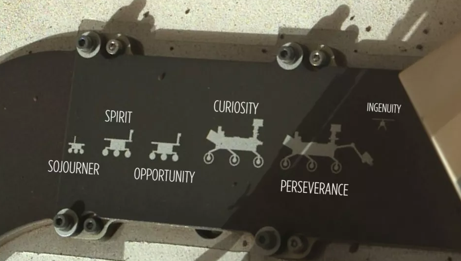
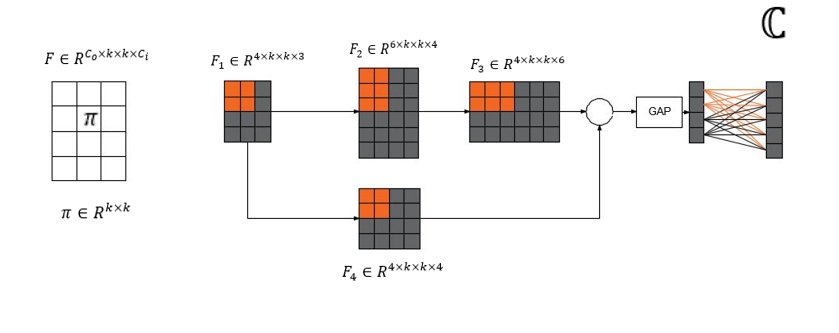
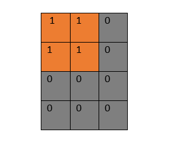
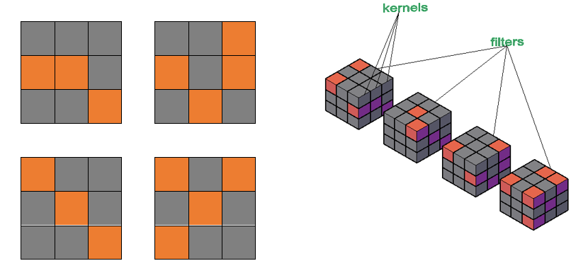
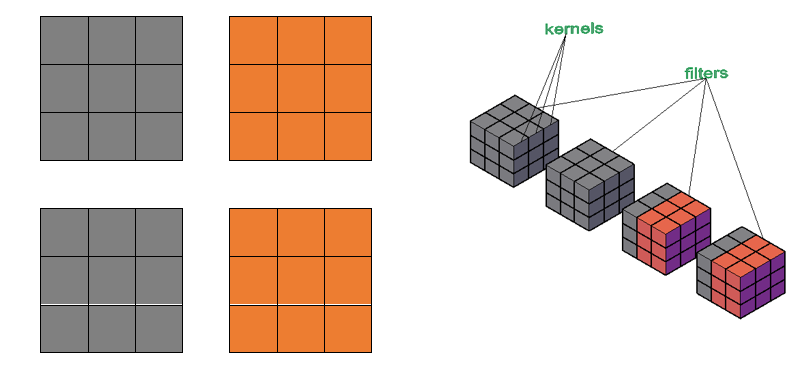
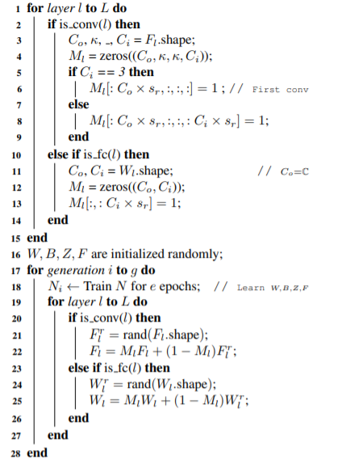

# Knowledge evolution in neural networks

*Nasa Mars Rovers Family Portrait (Image credit: NASA/JPL-Caltech)*

## 1.0 Introduction

In his book titled **The Mind’s Past (1998)**, Michael Gazzaniga wrote: “The baby does not learn trigonometry, but knows it; does not learn how to distinguish figure from ground, but knows it; does not need to learn, but knows, that when one object with mass hits another, it will move the object … The vast human cerebral cortex is chock full of specialized systems ready, willing, and able to be used for specific tasks. Moreover, the brain is built under tight genetic control … As soon as the brain is built, it starts to express what it knows, what it comes with from the factory. And the brain comes loaded. The number of special devices that are in place and active is staggering. Everything from perceptual phenomena to intuitive physics to social exchange rules comes with the brain. These things are not learned; they are innately structured. Each device solves a different problem … the multitude of devices we have for doing what we do are factory installed; by the time we know about an action, the devices have already performed it.” 

Gene transfer is the      passing on of genetic information (knowledge) from parent to offspring. Although the parent might have inferior knowledge, this knowledge evolves into superior knowledge across generations. Generally, offspring tend to have superior knowledge to       their parents. This phenomenon has been studied in different fields and is an active area of research in deep learning. The paper on knowledge evolution in neural networks adopts       this concept and applies       it to deep networks to help them learn better and become superior to previous generations. The knowledge of the deep network is infused into a subnetwork (fit hypothesis) which is trained for   ***g***   generations.

**Frankle** [3] describes a neural network as a set of hypotheses(subnetworks). Among these subnetworks, there exists a network that approximately describes      the original dense network(lottery ticket winner). Building on Girshock’s work, **Ramanujan** [2] proposes a method for sampling the optimal subnetwork from an untrained network, which shows similar or superior results to a trained network with the same number of parameters. On the other hand Knowledge Evolution (KE)[1], the concept that underpins this review propagates the random selection of a subnetwork (fit hypothesis, $H^F$) whose knowledge evolves across multiple generations. The fit hypothesis is trained for ***g*** generations until a      desired accuracy is achieved     . This subnetwork is a slim independent network with a small inference cost. KE can be applied to both vanilla convNets and modern residual ConvNets and achieve the state of the art results. Figue 1 illustrates the split network. 

*Figure 1: A split network illustration using a toy residual network. (Left) A convolutional filter F with $C_i=3$  input, $C_o=4$ output channels, and 2D kernels (e.g., $π ∈ R^{3×3}$ ). (Center-Right) A toy residual network N with a three-channel input (e.g., RGB image) and a five-logit output (C = 5). GAP denotes a global average pooling layer while $\oplus$ denotes the add operation. We split N into a fit-hypothesis $H^F$ (dark-blue) and a reset-hypothesis $H^R$ (gray). The fit-hypothesis $H^F$ is a slim network that can be extracted from the dense network N to perform inference efficiently. The paper appendix shows the dimensions of a fit-hypothesis in the ResNet18 architecture.*

## 2.0 KE training and splitting 

### 2.1 Training
For a deep network N with L layers, F filters, Z Batch norms, and fully connected layers with weight W and Bias B, knowledge evolution starts by conceptually splitting the network into two subnetworks: the fit subnetwork($H^F$) and the reset subnetwork($H^R$). These hypotheses are outlined by a binary mask as shown below:

${M=\{1,0\}^{C_o\times k \times k \times C_i}}$

*Figure 2: Binary Mask for the KELS technique*

Mathematically,

$H^F=MN$

$H^R={(1-M)}N$

The subnetworks are then randomly  initialized and the network N is trained for n generations. The next generation is derived when the network is re-initialized with the fit hypothesis; $N$ is reinitialized with ${H_1}^F$. For this generation, the reset hypothesis is initialized randomly just as in the previous generation and the network is re-trained for e epochs to get to the next generation. Thus, the knowledge inside the fit hypothesis is evolved across generations until better results that rival the original dense network are achieved. And since the reset hypothesis is randomly initialized for each generation, the fit hypothesis learns independent features thereby  mitigating overfitting for such a small data set. Formally, initialization of networks at ith generation is done for every layer and is as presented below:

$F_l = {F_l}{M_l} + {(1-M_l)}{F_l}^T$

where

$M$ is the binary mask

$F_l$ is a filter layer

${F_l}^T$ is a randomly initialized tensor

#### 2.1.1 Hyperparameters
While training the network N, the hyperparameters (Learning rate, batch size, number of epochs) remain the same across all generations. It might be interesting to consider rescheduling the hyperparameters for future research works to check if convergence can be achieved in a relatively short training period for other generations.

### 2. 2 Network splitting
Network splitting is achieved using two different approaches;

*  Individual weights are randomly split in each layer
 
*  Whole kernels for n filters are split.

#### (a) Weight Level Splitting (WELS)
For  every layer L, a binary mask, M splits L into  two exclusive subnetworks; fit hypothesis and reset hypothesis according to split rate,$0 <s_r<1$. Weight level splitting doesn’t produce a slim network, rather it produces a sparse network. Due to its irregularity, the WELS approach requires BLAS or specialized hardware for efficient training. Furthermore, WELS does not benefit from the connectivity of CNNs hence the need of the approach presented in (b). The WELS approach is as illustrated figure 3:

*Figure 3:  Demonstrates the Weight level splitting technique. 3D representation of the 4D tensor clarifies the visualization*

**Note:**The WELS approach belongs to a family of pruning methods called weight pruning. The resulting network is a sparse network

#### (b) Kernel Level Splitting (KELS)
The main contribution of the research paper under review is the KE and the KELS technique. KELS is different from WELS in that instead of splitting individual weights, whole kernels across m filters are split into the fit and reset hypotheses respectively. Hence for a split rate $s_r$ , KELS outlines the fit hypothesis to include the first [$s_r×C_i$] kernels and [$s_r×C_o$] filters.

*Figure 4:  Demonstrates the Kernel level splitting technique. 3D representation of the 4D tensor clarifies the visualization*

#### KE + KELS Training Algorithm
Figure 5 outlines the  algorithm for training the fit hypothesis using the Kernel level splitting technique

*Figure 5: KE + KELS Algorithm*

**Note:** A fit hypothesis is equivalent to a dense network with sparsity approximately equal to ${(1-{s_r}^2)}$. This is an approximation since the fully connected layer has some sparsity associated with it. To arrive at this formula, we consider the number of elements in the fit hypothesis over the total number of elements in a dense network.

Remember that KELS splits the network using the following scheme:"The first ${s_r}{C_o}$ filters and the first ${s_r}{C_i}$ kernels"

$kernels = C_o\times C_i$

$sparsity =1-{\frac{H^F}{N}} =1-{\frac{s_rC_o\times s_rC_i}{C_o\times C_i}} ={(1-{s_r}^2)}$

#### Example Network

The network architecture presented in table 1, highlights the KE + KELS technique                                                                                                                                     

It’s very clear from the networks presented above that KE+KELS significantly reduces the number of parameters thereby      reducing the number of operations. But since the training has to be done for n generations, the training time might usually be more than that for the dense network. The      trade-off is that this gives a better inference cost.

## 3.0 Key points from KE

* The binary mask is initialized once and for all.  The authors  iterated on the idea of having to modify the binary mask for each generation
* The paper focuses on KE + KELS as this requires no specialized hardware or sparse linear algebra libraries
* KE works seamless for both regression and classification tasks 
* Since the paper introduces KE and WELS, which themselves are variants of pruning techiques, the paper also disucess in detail how they relate to other pruning techniques.

# 4.0 Conclusion 

KE may make it possible for deep learning practitioners to train deep networks on relatively small datasets. This makes Knowledge Evolution a potential strong option for medical or navigation applications; i.e. where datasets are expensive and hard to collect. KE chooses a random inferior network (fit hypothesis) and evolves its knowledge across multiple generations. To enhance performance (training and inference ), KE uses the KELS approach to      split the network into 2 subnetworks. An alternative generalized approach (WELS) exists but requires specialized hardware and linear algebra libraries for efficient training. KE works seamlessly with metric learning (regression) and classification tasks. KE therefore perfectly infuses Michael Gazzaniga idea of Gene transfer in Machine Learning by depending on a small a dataset to evolve knowledge while preserving the quality of the model. 

## 5.0 References

[1] Taha,Shrivastava, Davis.Knowledge Evolution in Neural Networks.arXiv preprint arXiv :2103.05152, 2021

[2] Vivek Ramanujan, Mitchell Wortsman, Aniruddha Kembhavi, Ali Farhadi, and Mohammad Rastegari. What’s hiddenin a randomly weighted neural network? In CVPR, 2020.

[3] Jonathan Frankle and Michael Carbin. The lottery ticket hypothesis: Finding sparse, trainable neural networks. arXiv preprint arXiv:1803.03635, 2018. 

[4]  Song Han, Huizi Mao, and William J Dally. Deep compression: Compressing deep neural networks with pruning,trained quantization and huffman coding. arXiv preprint arXiv:1510.00149, 2015

[5] Michael S. Gazzaniga. The Mind's Past(1998)  
